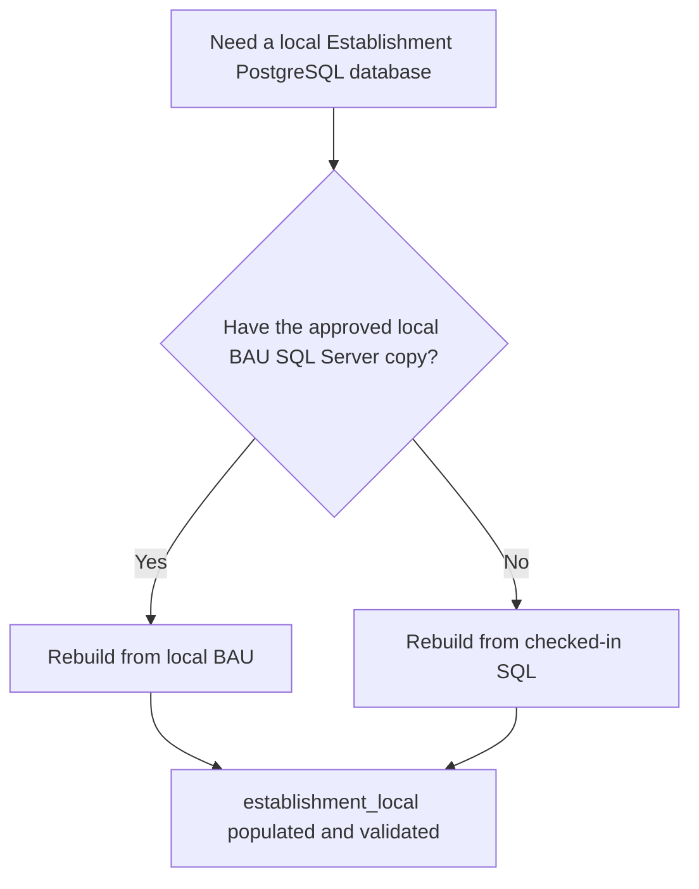

# Local Schema Automation

This directory contains the PostgreSQL physical schemas, SQL seeds and local
automation used to build the Education Provider Registry model.

## What is here

| Directory | Purpose |
| --- | --- |
| `establishment/` | Establishment PostgreSQL schema, loading SQL and validation SQL. |
| `governance/` | Governance PostgreSQL schema and migration SQL. |
| `seed/` | Checked-in reference data, sample Establishment data and the BAU selection manifest. |
| `automation/` | PowerShell commands for rebuilding local databases, extracting BAU data and validating the result. |

## Establishment rebuild paths

Choose the path that matches the data available on your machine:


```mermaid
flowchart TD
    start[Need a local Establishment PostgreSQL database] --> source{Have the approved local BAU SQL Server copy?}
    source -->|Yes| bau[Rebuild from local BAU]
    source -->|No| fixture[Rebuild from checked-in SQL]
    bau --> database[establishment_local populated and validated]
    fixture --> database
```

| Path | Use when | Command | Detailed runbook |
| --- | --- | --- | --- |
| BAU-source rebuild | You have `gias_bau_test_local` and the local SQL Server `reader` credential. | `rebuild-establishment-from-local-bau.ps1` | [Rebuild Establishment From Local BAU](automation/rebuild-establishment-from-local-bau.md) |
| Checked-in-fixture rebuild | You do not have the BAU SQL Server copy. | `rebuild-establishment-from-checked-in-sql.ps1` | [Rebuild Establishment From Checked-in SQL](automation/rebuild-establishment-from-checked-in-sql.md) |


## From zero to a populated local PostgreSQL database

1. Install PostgreSQL locally and create an empty database named
   `establishment_local`.

   ```powershell
   createdb.exe -h 127.0.0.1 -p 5432 -U postgres establishment_local
   ```

2. Configure the local PostgreSQL password in
   `%APPDATA%\postgresql\pgpass.conf`:

   ```text
   127.0.0.1:5432:establishment_local:postgres:<local-password>
   ```

3. From the repository root, choose one rebuild path.

   With checked-in SQL only **(Recommended)**:

   ```powershell
   powershell.exe -NoProfile -ExecutionPolicy Bypass -File ".\models\schema\automation\rebuild-establishment-from-checked-in-sql.ps1"
   ```

   With the approved local BAU copy:

   ```powershell
   powershell.exe -NoProfile -ExecutionPolicy Bypass -File ".\models\schema\automation\rebuild-establishment-from-local-bau.ps1" -SqlServer SL646104
   ```

   The BAU command prompts for the local SQL Server `reader` password. Use
   `-UseWindowsAuthentication` when the local SQL Server is configured for
   Windows authentication, or `-KeepFixture` to retain extracted CSVs for
   troubleshooting. `-IncludeGovernance` additionally rebuilds and loads the
   Governance schema. Use `-ExportDirectory` to write refreshed fixtures to a
   review directory instead of changing `seed/`.


4. The chosen command recreates the disposable `establishment` schema, loads
   reference and Establishment data, then validates the completed schema.

The scripts are intentionally restricted to the local
`establishment_local` database. They do not target shared environments.

The scripts are thin entry points to the `EprLocalAutomation` PowerShell module.
Any single step, such as one test or one establishment reload, can be run on its
own by importing the module. See the [automation README](automation/README.md).

## Establishment approval tests

The selected establishment cases are T1 (URN `136102`), T2 (URN `134314`) and
T20 (URN `135905`). The selected URNs and group-link fixtures are defined in
`seed/fixture-selection.json`; the scope test rejects any other establishment
URN. Each selected URN requires an approval snapshot. The checked-in SQL
fixture and approval directory currently contain the reviewed T1/T2 export;
the T20 approval and seed are added when the corresponding local BAU run has
been reviewed.

The Establishment snapshots compare business data and stable reference keys;
generated surrogate UUIDs are intentionally excluded because they are expected
to change when the local schema is rebuilt.

The rebuild scripts run these tests automatically at the end of each migration.
To run them directly from the repository root:

```powershell
.\models\schema\tests\assert-establishment-approval.ps1 -Urn 136102
.\models\schema\tests\assert-establishment-approval.ps1 -Urn 134314
.\models\schema\tests\assert-establishment-approval.ps1 -Urn 135905
.\models\schema\tests\assert-establishment-row-counts.ps1
```

The T1 approval snapshot is updated only when a data or model change is
deliberate and has been reviewed. Use the `-UpdateApproval` switch on the
approval script:

```powershell
.\models\schema\tests\assert-establishment-approval.ps1 -UpdateApproval
.\models\schema\tests\assert-establishment-approval.ps1 -Urn 136102 -UpdateApproval
.\models\schema\tests\assert-establishment-approval.ps1 -Urn 134314 -UpdateApproval
.\models\schema\tests\assert-establishment-approval.ps1 -Urn 135905 -UpdateApproval
```

The commands update the approval file for the specified URN. Only update a
snapshot after a deliberate, reviewed data or model change; then rerun the
normal rebuild and review the snapshot diff before committing it.

## Establishment cases

Each extract selected by the clean test-case matrix must have a corresponding
case file under `establishment/cases/`. The case is establishment-centric: it
records the T reference, URN, establishment name, establishment type and the
group links that make the establishment useful for the scenario. Add the case
file as part of reviewing an extract, before committing the refreshed seed.

Use the T reference and URN in the filename, for example:

`establishment/cases/t1-urn-136102-co-operative-academy-stoke-on-trent.md`

For example, T20 is recorded in
`establishment/cases/t20-urn-135905-manchester-creative-and-media-academy.md`.

If one T covers more than one establishment, document each URN in its own
section or companion case file and keep the shared T reference explicit.
