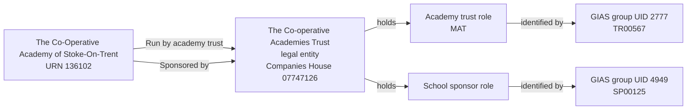

# T1: URN 136102, The Co-Operative Academy of Stoke-On-Trent

## Establishment

| Field | Value |
| --- | --- |
| URN | 136102 |
| Establishment number | 6905 |
| Name | The Co-Operative Academy of Stoke-On-Trent |
| Establishment type | Academy sponsor led |
| Education phase | Secondary |
| Local authority code | 861 |

## T1 group records

| Source group | Source type | Target role | Target responsibility | Group ID |
| ---: | --- | --- | --- | --- |
| 2777 | Multi-academy trust | Academy trust | Run by academy trust | TR00567 |
| 4949 | School sponsor | School sponsor | Sponsored by | SP00125 |

The sponsor record is named `The Co-operative Group` in the local BAU copy and does not carry a Companies House number. T1 resolves it to the same legal entity as MAT group 2777, The Co-operative Academies Trust, Companies House number `07747126`. The two source group records remain distinct identifiers and roles in the migration evidence.

Both responsibilities start on 1 September 2014 in the local BAU copy. The academy-trust classification is multi-academy trust.

## Relationship graph



## Extract query

Run the following query against `establishment_local` after the T1 migration.
It returns the establishment, its two responsibilities, the resolved legal
entity, both party roles, the MAT classification and all four GIAS identifiers.

```sql
WITH target AS (
    SELECT *
    FROM establishment.establishment
    WHERE urn = 136102
),
responsibilities AS (
    SELECT er.*, rt.name AS responsibility_type
    FROM establishment.establishment_responsibility AS er
    JOIN target AS e USING (establishment_id)
    JOIN establishment.responsibility_type AS rt
      USING (responsibility_type_id)
),
parties AS (
    SELECT DISTINCT le.*
    FROM establishment.legal_entity AS le
    JOIN responsibilities AS er USING (legal_entity_id)
),
roles AS (
    SELECT r.*, rpt.name AS role_type
    FROM establishment.establishment_party_role AS r
    JOIN parties AS le USING (legal_entity_id)
    JOIN establishment.establishment_party_role_type AS rpt
      USING (establishment_party_role_type_id)
),
classifications AS (
    SELECT atc.*, att.name AS academy_trust_type
    FROM establishment.academy_trust_classification AS atc
    JOIN roles AS r USING (establishment_party_role_id)
    JOIN establishment.academy_trust_type AS att
      USING (academy_trust_type_id)
),
identifiers AS (
    SELECT gi.*, git.name AS identifier_type, issuer.name AS issuer
    FROM establishment.group_identifier AS gi
    JOIN roles AS r USING (establishment_party_role_id)
    JOIN establishment.group_identifier_type AS git
      USING (group_identifier_type_id)
    JOIN establishment.identifier_issuer AS issuer
      USING (identifier_issuer_id)
)
SELECT 'establishment' AS record_type, to_jsonb(e) AS data
FROM target AS e
UNION ALL
SELECT 'responsibility', to_jsonb(er)
FROM responsibilities AS er
UNION ALL
SELECT 'legal_entity', to_jsonb(le)
FROM parties AS le
UNION ALL
SELECT 'party_role', to_jsonb(r)
FROM roles AS r
UNION ALL
SELECT 'academy_trust_classification', to_jsonb(c)
FROM classifications AS c
UNION ALL
SELECT 'group_identifier', to_jsonb(i)
FROM identifiers AS i
ORDER BY record_type;
```

