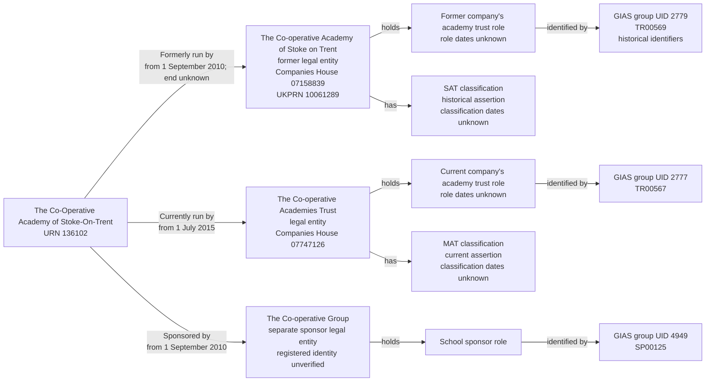

# T1: URN 136102, The Co-Operative Academy of Stoke-On-Trent

## Establishment

| Field | Value |
| --- | --- |
| URN | 136102 |
| Establishment number | 6905 |
| Name | The Co-Operative Academy of Stoke-On-Trent |
| Establishment type | Academy sponsor led |
| Education phase | Secondary |
| Local authority code | 861 |

## T1 group records

| Source group | Source type | Source status | Effective date | Target role | Target responsibility | Group ID | Companies House number | UKPRN |
| ---: | --- | --- | --- | --- | --- | --- | --- | --- |
| 2779 | Single-academy trust | Archived link | 1 September 2010 | Academy trust | Run by academy trust | TR00569 | 07158839 | 10061289 |
| 2777 | Multi-academy trust | Active link | 1 July 2015 | Academy trust | Run by academy trust | TR00567 | 07747126 | 10059286 |
| 4949 | School sponsor | Active link | 1 September 2010 | School sponsor | Sponsored by | SP00125 | Not supplied | Not supplied |

The former SAT, THE CO-OPERATIVE ACADEMY OF STOKE ON TRENT, and the current MAT, THE CO-OPERATIVE ACADEMIES TRUST, are separate legal entities. They have different Companies House numbers, UKPRNs and Group IDs. The SAT's incorporation date is 16 February 2010; the MAT's is 19 August 2011. T1 represents a change of operator, not a SAT-to-MAT classification change within one company.

The SAT responsibility begins on 1 September 2010 and is historical. Its end date remains unknown: the archived link does not supply a relationship end date, and the MAT's start date is not copied into it. The MAT responsibility begins on 1 July 2015 and is current. Each legal entity has its own academy-trust role and classification; the role and classification dates remain unknown.

The sponsor record is named `The Co-operative Group` in the local BAU copy. It has its own legal entity and school-sponsor role, separate from both academy-trust companies. BAU supplies neither a Companies House number nor a UKPRN for this sponsor, so neither organisation identifier is created. Its precise registered legal identity remains unverified. Each source group's UID and Group ID belong to its corresponding role.

The academy's [Co-op Academies Trust page](https://www.stokeontrent.coopacademies.co.uk/content/?contentid=11&pid=10) explicitly states: “Our Trust is proud to be sponsored by the Co-op Group”. It also gives the trust's company registration number as 07747126. This supports keeping the operator and sponsor separate; it does not establish the sponsor's registration number or historical relationship dates.

The active MAT group makes the MAT responsibility and the MAT classification current. The archived SAT group makes the SAT responsibility and SAT classification historical. This current-state assertion is explicit; it is not derived from the dates.

The sponsor responsibility starts on 1 September 2010. The academy-trust responsibility history identifies the former SAT from 1 September 2010 and the separate MAT from 1 July 2015. The exact end of the former operator's responsibility is not asserted.

The source does not provide dates for the academy-trust or school-sponsor party roles, so their start and end dates are also `NULL`.

## Relationship graph



## Extract query

Run the following query against `establishment_local`. It returns the establishment, its responsibility history, all three legal entities, their party roles, the separate SAT and MAT classifications and all GIAS identifiers.

```sql
WITH target AS (
    SELECT *
    FROM establishment.establishment
    WHERE urn = 136102
),
responsibilities AS (
    SELECT er.*, rt.name AS responsibility_type
    FROM establishment.establishment_responsibility AS er
    JOIN target AS e USING (establishment_id)
    JOIN establishment.establishment_responsibility_type AS rt
      USING (responsibility_type_id)
),
parties AS (
    SELECT DISTINCT le.*
    FROM establishment.legal_entity AS le
    JOIN responsibilities AS er USING (legal_entity_id)
),
roles AS (
    SELECT r.*, rpt.name AS role_type
    FROM establishment.establishment_party_role AS r
    JOIN parties AS le USING (legal_entity_id)
    JOIN establishment.establishment_party_role_type AS rpt
      USING (establishment_party_role_type_id)
),
classifications AS (
    SELECT atc.*, att.name AS academy_trust_type
    FROM establishment.academy_trust_classification AS atc
    JOIN parties AS le USING (legal_entity_id)
    JOIN establishment.academy_trust_type AS att
      USING (academy_trust_type_id)
),
identifiers AS (
    SELECT gi.*, git.name AS identifier_type, issuer.name AS issuer
    FROM establishment.group_identifier AS gi
    JOIN roles AS r USING (establishment_party_role_id)
    JOIN establishment.group_identifier_type AS git
      USING (group_identifier_type_id)
    JOIN establishment.group_identifier_issuer AS issuer
      USING (group_identifier_issuer_id)
)
SELECT 'establishment' AS record_type, to_jsonb(e) AS data
FROM target AS e
UNION ALL
SELECT 'responsibility', to_jsonb(er)
FROM responsibilities AS er
UNION ALL
SELECT 'legal_entity', to_jsonb(le)
FROM parties AS le
UNION ALL
SELECT 'party_role', to_jsonb(r)
FROM roles AS r
UNION ALL
SELECT 'academy_trust_classification', to_jsonb(c)
FROM classifications AS c
UNION ALL
SELECT 'group_identifier', to_jsonb(i)
FROM identifiers AS i
ORDER BY record_type;
```

