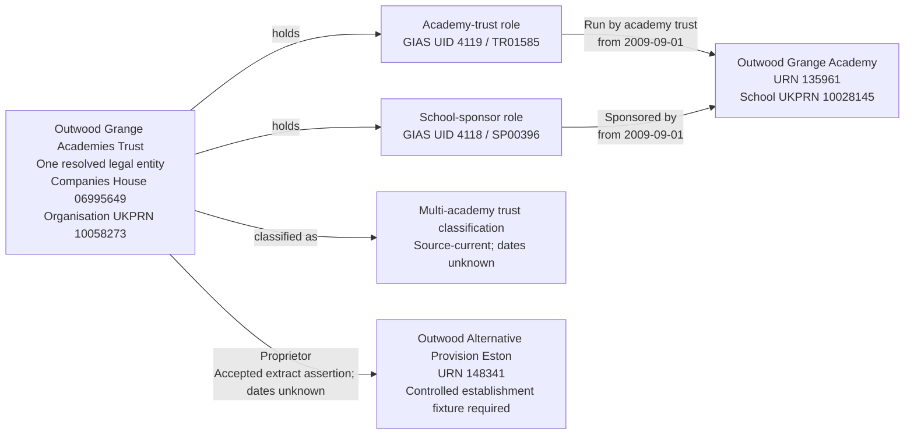

# T10 — Outwood Grange Academies Trust has three kinds of responsibility

T10 tests that Outwood Grange Academies Trust is recorded as one legal entity running and sponsoring Outwood Grange Academy and acting as proprietor of Outwood Alternative Provision Eston, without asserting ownership of either school's business or premises.

## One party, different responsibilities

The selected slice contains two establishments, one legal entity, two party roles and three establishment responsibilities. The Academy trust and School sponsor roles have separate GIAS group identifiers. Proprietorship is a responsibility directly held by the same legal entity; it does not create a third party-role type.

Only one academy is selected to exercise operator and sponsor coexistence. The wider Outwood portfolio is outside this slice.

## Establishments

| Field | T10a — independent school | T10b — academy |
| --- | --- | --- |
| URN | 148341 | 135961 |
| Establishment name | Outwood Alternative Provision Eston | Outwood Grange Academy |
| Establishment type | Other independent school (source code 11) | Academy sponsor led (source code 28) |
| Accepted extract status | Open (1) | Open (1) |
| Accepted extract open date | 2021-02-18 | 2009-09-01 |
| Accepted extract close date | Null | Null |
| Accepted extract school UKPRN | 10092329 | 10028145 |
| Accepted extract local authority | Redcar and Cleveland (807) | Wakefield (384) |
| Exact extract `PropsName` | Outwood Grange Academies Trust | Empty |

These establishment and proprietor assertions come from the 16 June 2026 establishment extract, `edubasealldata20260616.csv`. The selected values are reproduced above. The academy's identity and lifecycle agree with the selected local source record; the independent school's do not, as described below.

The school's UKPRNs identify the establishments. Neither is the trust's organisation UKPRN.

## Local group and relationship evidence

| Field | Academy-trust record | Sponsor record |
| --- | --- | --- |
| Source name | OUTWOOD GRANGE ACADEMIES TRUST | Outwood Grange Academies Trust |
| Group UID | 4119 | 4118 |
| Group ID | TR01585 | SP00396 |
| Group type | Multi-academy trust (06) | School sponsor (05) |
| Companies House number | 06995649 | Null |
| Organisation UKPRN | 10058273 | Null |
| Source group open date | 2009-08-19 | 1900-01-01 — placeholder |
| Source group closed date | Null | Null |
| Source group local-authority code | 999 (not recorded) | 999 (not recorded) |
| Selected establishment | Outwood Grange Academy, URN 135961 | Outwood Grange Academy, URN 135961 |
| GroupLink ID | 5716 | 5254 |
| Link effective date | 2009-09-01 | 2009-09-01 |
| Link archived / version | 0 / 0 | 0 / 0 |
| Link `linkType` / `ccLinkType` | Both null | Both null |

Both selected links are active and supply non-placeholder responsibility starts. The local active link sets for UIDs 4118 and 4119 are identical and non-empty, with 21 active links each. The full local sets contain 25 sponsor rows and 24 MAT rows, each covering 24 distinct URNs. These counts are local observations, not the 40-academy June-extract portfolio, and they do not imply that every unselected link is clean.

The reviewed sponsor-to-trust identity resolution uses the matching names and shared active link set alongside the identified MAT party. The sponsor does not independently supply a company number or UKPRN. Preserve that identity decision rather than treating name equality alone as a universal matching rule.

## Controlled proprietor and establishment evidence

The accepted proprietor assertion resolves the independent school's exact extract `PropsName` to the same Outwood legal entity. This is an explicitly accepted proprietor-identity assumption for this controlled fixture, not a direct identity match from the obfuscated local proprietor fields.

The local copy of URN 148341 differs from the accepted extract:

| Field | Local source | Accepted extract |
| --- | --- | --- |
| Status | Rejected opening (8) | Open (1) |
| Open date | 2018-11-10 | 2021-02-18 |
| Close date | 2018-11-10 | Null |
| Establishment UKPRN | Null | 10092329 |
| Local-authority code | 865 | 807 |
| Proprietor classification | N/A (03) | Named proprietor body assertion |

The local copy has no group links for URN 148341 and no additional `EstablishmentProprietors` rows for it. That does not contradict a proprietor responsibility: proprietors are not represented by GIAS group links.

This case therefore needs more than a proprietor-name overlay. Before migration, explicitly review and accept a controlled establishment fixture based on the extract, or provide a suitable corrected local establishment record. Do not silently present the extract's open status, dates, UKPRN or geography as local BAU values. Do not import the local rejected-opening lifecycle together with a current open-school proprietor assertion and claim the result is a clean source migration.

The proprietor-identity assumption does not resolve the lifecycle discrepancy. The two observations must remain separate in migration evidence. No source database or target records are changed by this case document.

## Relationship graph

The academy-trust and sponsor arrows represent separate responsibilities held by the same legal entity. The proprietor arrow means responsibility for managing the independent school, not ownership of its business, assets, land, buildings or operating-company shares.

## Target interpretation

These expectations apply once the controlled establishment and proprietor assertions have been accepted for migration.

| Target table | Expected records for T10 |
| --- | --- |
| `establishment` and core substructures | Two separate establishments. Load the academy from the reviewed local source; the independent school's lifecycle, identifiers and geography require an explicitly accepted controlled mapping before import. |
| `legal_entity` | One Outwood legal entity shared by all three responsibilities, not separate trust, sponsor and proprietor entities. |
| `organisation_identifier` | Current Companies House number `06995649` and organisation UKPRN `10058273`, both attached to that one legal entity and sourced from MAT UID 4119. |
| Legal form and company dates | The existing MR011 academy-trust mapping supplies Charitable company limited by guarantee as a migration assumption; the MAT group open date supplies the current mapping's incorporation date 2009-08-19. Neither is described as a fresh Companies House verification. Charity status and dissolution date are not invented. |
| `establishment_party_role` | Two roles: Academy trust and School sponsor, held by the same legal entity. Role start/end dates remain unknown. No Proprietor role is created. |
| `group_identifier` | UID 4119 / TR01585 on the Academy trust role; UID 4118 / SP00396 on the School sponsor role. All four are source-current, with issuer GIAS. No group identifier is created for proprietorship. |
| `academy_trust_classification` | One source-current MAT classification with unknown start/end dates. |
| `establishment_responsibility` | Run by academy trust (MAT) and Sponsored by responsibilities for URN 135961, both current from 2009-09-01 with unknown ends; one current Proprietor responsibility for URN 148341 from the accepted extract assertion, with unknown start/end dates. |
| `person`, `organisation_group`, `organisation_group_member` | No records created to represent these three responsibilities. |
| Migration evidence | Retain GroupLinks 5716 and 5254, the shared-party identity decisions, exact proprietor assertion and extract observation date 2026-06-16. Retain the local lifecycle/proprietor context and controlled establishment-field decisions separately beneath the import run. |

Proprietor is a responsibility without a corresponding party role. The academy-trust legal form and incorporation date above are migration assumptions; authoritative Companies House verification and enrichment remain deferred.

## Dates and evidence limits

- The two academy responsibility starts come from their respective GroupLinks, not from group opening or company incorporation.
- Sponsor group open date 1900-01-01 is a placeholder. Retain it as raw migration evidence; do not populate a role start or company date with it.
- The independent school's accepted opening date does not establish when Outwood became its proprietor. Keep the responsibility start null and retain the extract observation date in migration evidence.
- Matching active link sets support the reviewed sponsor/trust consolidation; they do not prove legal identity of an unrelated proprietor name by themselves.
- The accepted proprietor decision does not establish ownership, and its relationship cannot resolve the conflicting local establishment lifecycle.
- No unrelated academy links or historical responsibility ends are inferred by this slice.

## Expected checks

- Exactly one selected Outwood legal entity holds all three responsibilities across the two selected establishments.
- The two schools retain separate identities and their own school UKPRNs; neither school UKPRN is assigned to the trust.
- Two party roles and four correctly owned GIAS identifiers are retained; there is no Proprietor role or proprietor group identifier.
- The academy has exactly one current MAT operating responsibility and one separate current sponsorship responsibility, both pointing to Outwood.
- The independent school has a current Proprietor responsibility to the same legal entity, not an invented academy-trust operating responsibility.
- Both academy responsibility starts are 2009-09-01; the proprietor responsibility and role/classification boundaries remain unknown.
- The sponsor placeholder date is excluded from target business dates and retained in migration evidence.
- The controlled independent-school fields and proprietor identity decision are explicit, traceable and not substituted for raw local facts.
- Re-running the eventual migration reuses the resolved party and does not duplicate its roles, identifiers or responsibilities.

