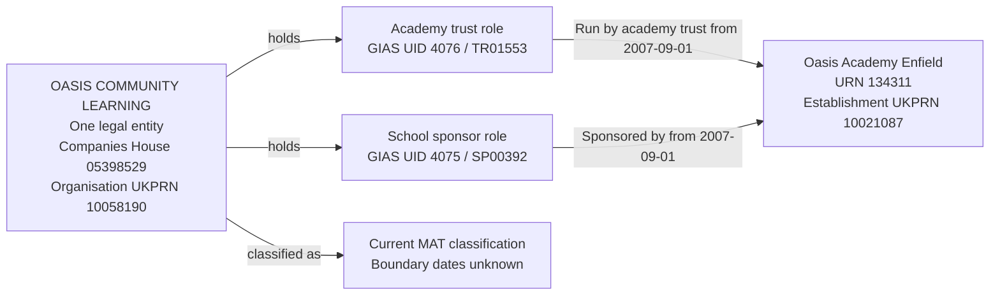

# T11R: Oasis Academy Enfield shares one operator and sponsor

T11R tests that Oasis Community Learning is represented by one legal entity holding separate Academy trust and School sponsor roles for Oasis Academy Enfield. Both responsibilities and their source identifiers must survive identity resolution.

**Test-case assumption:** Sponsor UID 4075, `Oasis Community Learning`, and MAT UID 4076, `OASIS COMMUNITY LEARNING`, represent the same legal entity, company number `05398529`. This assumption is accepted for this test case; BAU explicitly supplies the company number only on the MAT record.

## Establishment

| Field | Local source value |
| --- | --- |
| URN | 134311 |
| Name | Oasis Academy Enfield |
| Establishment number | 6905 |
| Establishment type | Academy sponsor led (28) |
| Status | Open (1) |
| Local-authority code | 308 |
| Open date | 2007-09-01 |
| Close date | Null |
| Establishment UKPRN | 10021087 |

## Local source evidence

The selected case is Oasis Academy Enfield. The source evidence covers groups 4075 and 4076, their distinct current and full URN sets, and all group links for the selected establishment. Enfield was the lowest URN with active links to both groups, an open establishment with no close date, and non-placeholder link dates.

| Field | Sponsor record | Academy-trust record |
| --- | --- | --- |
| Exact source name | Oasis Community Learning | OASIS COMMUNITY LEARNING |
| Group UID | 4075 | 4076 |
| Group ID | SP00392 | TR01553 |
| Group type | School sponsor (05) | Multi-academy trust (06) |
| Companies House number | Null | 05398529 |
| Organisation UKPRN | Null | 10058190 |
| Group open date | 1900-01-01, placeholder | 2005-03-18 |
| Group closed date | Null | Null |
| Selected GroupLink ID | 4024 | 8088 |
| Link effective date | 2007-09-01 | 2007-09-01 |
| Link archived / version | 0 / 0 | 0 / 0 |
| Link `linkType` / `ccLinkType` | Both null | Both null |
| Target role | School sponsor | Academy trust |
| Target responsibility | Sponsored by | Run by academy trust |

The complete local group-link slice for URN 134311 contains exactly these two links. Both are current and have valid responsibility start dates.

Each group has 47 current links covering 47 distinct URNs, with no difference between the two current URN sets. Across current and archived links, both cover the same 48 distinct URNs. The sponsor has 49 total rows, including two archived rows; the MAT has 48 total rows, including one archived row. Equal distinct URN sets do not imply identical relationship-row histories. Unselected historical rows are outside this case's clean migration claim.

## Relationship graph



The two responsibilities have the same legal-entity holder, but different meanings. Running the academy and sponsoring it remain separate relationships, each with its own party role and GIAS identifiers.

## Target interpretation

Under the accepted test-case assumption, resolve sponsor UID 4075 to the legal entity identified by MAT UID 4076. The matching names and equal, non-empty current and full URN sets support the assumption, but do not directly prove shared legal identity. Use the MAT source name `OASIS COMMUNITY LEARNING` for the legal entity and preserve both raw names and the explicit assumption in migration evidence.

Scenarios like this require a migration decision before the actual migration. Where a sponsor and trust have similar names, triage the pair for manual review to establish whether they represent one entity or separate entities. Record the evidence and accepted decision before applying the identity mapping. Similar names alone must not trigger an automatic merge; an unresolved pair remains pending review.

The target model separates legal-entity identity, party roles, academy-trust classification and establishment-specific responsibilities. Each source Group UID and Group ID belongs to its corresponding party role.

| Target table | Expected records for T11R |
| --- | --- |
| `establishment` and core substructures | One establishment, URN 134311, with its own UKPRN 10021087. |
| `legal_entity` | One Oasis legal entity shared by both roles and responsibilities. |
| `organisation_identifier` | Companies House number `05398529` and organisation UKPRN `10058190`, attached to the legal entity and sourced from MAT UID 4076. |
| Legal form and company dates | Charitable company limited by guarantee is a migration assumption for the academy trust with a supplied company number. The current academy-trust mapping uses MAT open date 2005-03-18 as incorporation date. Neither is a fresh register verification. Dissolution date remains null. |
| `establishment_party_role` | Two roles held by that entity: Academy trust and School sponsor. Start and end dates remain null. |
| `group_identifier` | UID 4076 / TR01553 belongs to the Academy trust role; UID 4075 / SP00392 belongs to the School sponsor role. All four identifiers are source-current, with issuer GIAS. |
| `academy_trust_classification` | One current MAT classification, with unknown start and end dates. |
| `establishment_responsibility` | Two current responsibilities for URN 134311, both starting 2007-09-01 with unknown ends. Only Run by academy trust carries the MAT type. |
| `person`, `organisation_group`, `organisation_group_member` | No records created to represent this slice. |
| Migration evidence | Retain both raw group records, GroupLinks 4024 and 8088, the accepted test-case identity assumption and supporting link-set comparison beneath the import run. For actual migration, retain the manual review evidence and accepted identity decision. |

The sponsor's 1900-01-01 date is retained as raw evidence and excluded from target business dates. The school's opening date and link dates do not establish when Oasis first held either party role or became a MAT. The trust UKPRN and school UKPRN identify different things and must remain separately owned.

## Evidence limits

The sponsor supplies no independent company number or organisation UKPRN. No `GroupRelationsLink` involves either selected record, and no shared `saOrgId` links them: only the MAT supplies one. The inspected BAU records therefore do not explicitly assert that the sponsor and MAT are the same entity. The accepted shared-party assumption applies only to this test case. Conflicting identifiers or changed link-set evidence require review. The wider Oasis portfolio supports the assumption but is outside the selected migration slice.

No structural DQ concern was identified in the selected links. This assessment concerns local source evidence, not fresh Companies House verification or certification of every establishment field.

## Target query

```sql
SELECT e.urn, e.name AS establishment,
       le.legal_entity_id, le.name AS legal_entity,
       role_type.name AS party_role,
       ids.gias_group_uid, ids.gias_group_id,
       rt.name AS responsibility,
       trust_type.name AS responsibility_trust_type,
       r.start_date, r.end_date, r.is_current,
       role.start_date AS role_start, role.end_date AS role_end
FROM establishment.establishment e
JOIN establishment.establishment_responsibility r USING (establishment_id)
JOIN establishment.establishment_responsibility_type rt USING (responsibility_type_id)
JOIN establishment.legal_entity le USING (legal_entity_id)
JOIN establishment.establishment_party_role role
  ON role.legal_entity_id=le.legal_entity_id
JOIN establishment.establishment_party_role_type role_type USING (establishment_party_role_type_id)
LEFT JOIN establishment.academy_trust_type trust_type
  ON trust_type.academy_trust_type_id=r.academy_trust_type_id
LEFT JOIN LATERAL (
    SELECT max(i.value) FILTER (WHERE t.name='Group UID') AS gias_group_uid,
           max(i.value) FILTER (WHERE t.name='Group ID') AS gias_group_id
    FROM establishment.group_identifier i
    JOIN establishment.group_identifier_type t USING (group_identifier_type_id)
    JOIN establishment.group_identifier_issuer issuer USING (group_identifier_issuer_id)
    WHERE i.establishment_party_role_id=role.establishment_party_role_id
      AND issuer.name='GIAS' AND i.is_current
) ids ON true
WHERE e.urn=134311
  AND ((rt.name='Sponsored by' AND role_type.name='School sponsor')
    OR (rt.name='Run by academy trust' AND role_type.name='Academy trust'))
ORDER BY rt.name;
```

After migration, the expected result is two rows sharing one `legal_entity_id`: an Academy trust role with UID 4076 / TR01553 and a School sponsor role with UID 4075 / SP00392. Both responsibilities start on 2007-09-01 and are current. Only the operating responsibility is typed MAT.

## Expected checks

- Exactly one Oasis legal entity is created for the selected pair, with two distinct party roles.
- The shared legal identity is recorded as an accepted test-case assumption, not as an explicit BAU identity link or a general name-matching rule.
- Both source Group UIDs and Group IDs are retained on their correct roles.
- Exactly one current operating responsibility and one current sponsorship responsibility exist for URN 134311, both pointing to the same legal entity through their respective roles.
- Both responsibility starts are 2007-09-01; their ends and the role/classification boundary dates remain null.
- The sponsor responsibility has no academy-trust classification type; the operating responsibility has MAT type.
- Company number `05398529` retains its leading zero. Organisation UKPRN `10058190` is not substituted for school UKPRN `10021087`.
- No 1900-01-01 placeholder enters a target business date.
- No other Oasis establishments or historical links are imported by this case.
- Reimporting either selected link reuses the resolved legal entity, roles, identifiers and responsibilities without duplication; importing the links in the opposite order produces the same result.
