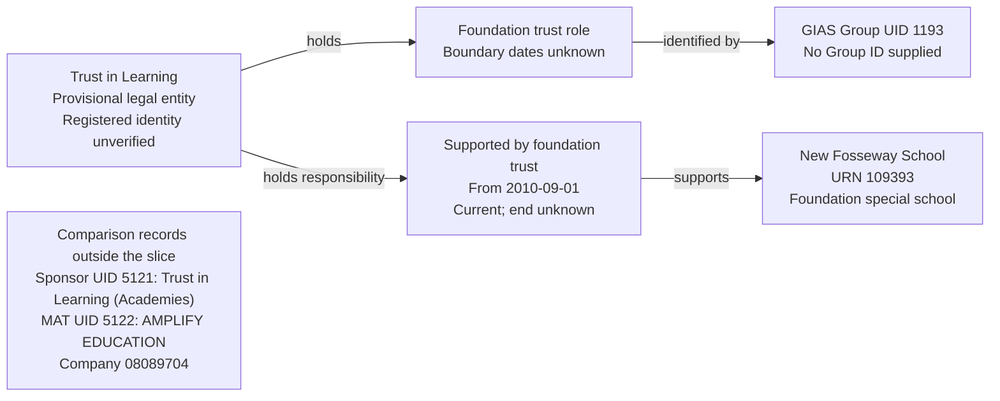

# T12: New Fosseway School and Trust in Learning

T12 tests that Trust in Learning is represented as a foundation trust supporting New Fosseway School, and is not merged with similarly named sponsor or academy-trust records on name alone.

The selected slice contains one establishment, one provisional legal entity, one Foundation trust role and one support responsibility. Registered identity remains subject to a migration decision.

## Establishment

| Field | Local source value |
| --- | --- |
| URN | 109393 |
| Establishment name | New Fosseway School |
| Establishment number | 7014 |
| Establishment type | Foundation special school (12) |
| Status | Open (1) |
| Local-authority code | 801 |
| Establishment UKPRN | 10016445 |
| Open date | Null |
| Close date | Null |

The school has no recorded open date in the selected source record. Its current status does not supply a missing opening date.

## Local source evidence

| Field | Selected foundation trust |
| --- | --- |
| Source name | Trust in Learning |
| Group UID | 1193 |
| Group ID | Null |
| Group type | Trust (02), mapped to Foundation trust |
| Companies House number | Null |
| Organisation UKPRN | Null |
| Group open date | 2008-09-01 |
| Group closed date | Null |
| Group local-authority code | 999 (not recorded) |
| Source GroupLink ID | 595 |
| Linked establishment URN | 109393 |
| Link effective date | 2010-09-01 |
| Link archived / version | 0 / 0 |
| Link `linkType` / `ccLinkType` | Both null |

The school has exactly one source group link: GroupLink 595 to UID 1193. The foundation trust has four links covering four distinct establishments, all marked non-archived. Only the New Fosseway link is selected; links 343, 341 and 342 to URNs 109127, 109282 and 109286 are outside this slice. Their non-archived flags alone do not establish valid current responsibilities.

The source also contains the following comparison records:

| Field | Similar-name sponsor | Academy trust |
| --- | --- | --- |
| Source name | Trust in Learning (Academies) | AMPLIFY EDUCATION |
| Group UID | 5121 | 5122 |
| Group ID | SP00586 | TR02329 |
| Group type | School sponsor (05) | Multi-academy trust (06) |
| Companies House number | Null | 08089704 |
| Organisation UKPRN | Null | 10059816 |
| Group open date | 1900-01-01, placeholder | 2012-05-30 |
| Group closed date | Null | Null |

Neither comparison record is linked to URN 109393. No `GroupRelationsLink` involving foundation-trust UID 1193 was returned. These comparison records identify a name-collision risk; they are not additional migration inputs for this case.

## Relationship graph



The comparison records have no shared-identity edge to the selected foundation trust. Similar wording does not authorise consolidation or create an academy-operating relationship for New Fosseway School.

## Target interpretation

| Target table | Expected records for T12 |
| --- | --- |
| `establishment` | One New Fosseway School record, URN 109393, retaining school UKPRN 10016445, Foundation special school type and unknown opening date. |
| `legal_entity` | One provisional record named Trust in Learning, identified through the selected source UID. Do not attach it to Amplify solely because of similar names. Registered legal form, incorporation and dissolution dates remain unknown. |
| `establishment_party_role` | One Foundation trust role with unknown start and end dates. |
| `group_identifier` | One current GIAS Group UID `1193` on the Foundation trust role. No Group ID is invented. |
| `establishment_responsibility` | One current Supported by foundation trust responsibility for URN 109393, starting on 2010-09-01 with unknown end. `academy_trust_type_id` and `person_id` remain null. |
| `organisation_identifier` | No company number or organisation UKPRN is supplied by the selected group record. Do not copy Amplify's identifiers or the school's UKPRN to the foundation trust. |
| `academy_trust_classification`, `organisation_group`, `organisation_group_member`, `person` | No records created to represent this foundation-trust support relationship. |
| Migration evidence | Retain UID 1193, GroupLink 595, the source group open date and active-link assertion, plus the provisional identity allocation and outstanding review requirement. |

The responsibility start comes from GroupLink 595. The foundation-trust group open date is not a company incorporation date or a party-role start. The missing school open date remains null. Source group authority code 999 is not replaced with the school's authority code merely because the trust supports that school.

## Evidence limits

The selected link has a valid, non-placeholder effective date and connects an open establishment to a source-open foundation trust. This supports the bounded support relationship, but does not verify the trust's registered legal identity or every establishment field.

BAU supplies company number `08089704` only for the comparison MAT, not for UID 1193. It does not supply a second company number that directly establishes two different companies. This case therefore tests protection against an unsupported name-based merge, rather than claiming that BAU conclusively proves separate registered identities.

Actual migration requires a recorded identity decision for these potentially confusable records. Reviewers should determine whether they represent one entity or separate entities using available identifiers and authoritative evidence. Until that decision is made, do not consolidate UID 1193 with UIDs 5121 or 5122 or treat the provisional allocation as a verified company identity.

This case does not decide whether sponsor UID 5121 and MAT UID 5122 represent the same entity. It imports neither comparison record nor the foundation trust's other three school links.

## Target query

```sql
SELECT e.urn, e.name AS establishment,
       le.legal_entity_id, le.name AS foundation_trust,
       role_type.name AS party_role,
       gi.value AS gias_group_uid,
       role.start_date AS role_start_date,
       role.end_date AS role_end_date,
       rt.name AS responsibility,
       r.start_date AS responsibility_start_date,
       r.end_date AS responsibility_end_date,
       r.is_current
FROM establishment.establishment e
JOIN establishment.establishment_responsibility r USING (establishment_id)
JOIN establishment.establishment_responsibility_type rt USING (responsibility_type_id)
JOIN establishment.legal_entity le USING (legal_entity_id)
JOIN establishment.establishment_party_role role ON role.legal_entity_id=le.legal_entity_id
JOIN establishment.establishment_party_role_type role_type USING (establishment_party_role_type_id)
JOIN establishment.group_identifier gi USING (establishment_party_role_id)
JOIN establishment.group_identifier_type git USING (group_identifier_type_id)
JOIN establishment.group_identifier_issuer issuer USING (group_identifier_issuer_id)
WHERE e.urn=109393
  AND rt.name='Supported by foundation trust'
  AND role_type.name='Foundation trust'
  AND git.name='Group UID' AND issuer.name='GIAS'
  AND gi.value='1193' AND gi.is_current
ORDER BY r.start_date;
```

After migration, the expected result is one support-responsibility row for Trust in Learning, identified through role UID 1193, current from 2010-09-01 with an unknown end.

## Expected checks

- One establishment, one provisional legal entity, one Foundation trust role and one support responsibility represent the selected slice.
- Group UID 1193 belongs to the Foundation trust role and resolves to the responsibility's legal entity.
- The responsibility starts on 2010-09-01; role boundaries, incorporation date and school opening date remain unknown.
- No Group ID, company number, organisation UKPRN or registered legal form is invented for the foundation trust.
- Company number `08089704` and organisation UKPRN `10059816` are not assigned to the foundation trust by name similarity; school UKPRN `10016445` remains on the establishment.
- No Academy trust role, MAT classification, operating responsibility or federation membership is created from the selected link.
- The import does not silently consolidate UID 1193 with comparison UIDs 5121 or 5122, including when similarly named parties already exist in the target. An unresolved name collision requires review.
- GroupLink 595 and the provisional identity decision remain traceable; the comparison records and three unselected foundation-trust links are not imported.
- Reimport reuses the source-UID identity allocation without duplicating the role, identifier or responsibility.
