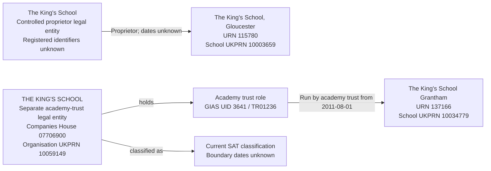

# T13: The King's School names two distinct parties

T13 tests that a proprietor called The King's School and an academy trust called THE KING'S SCHOOL remain separate legal entities despite their matching names. The proprietor is responsible for The King's School, Gloucester; the academy trust runs The King's School Grantham.

**Test-case assumption:** The Gloucester proprietor and Grantham academy trust are distinct parties. This is an accepted controlled-fixture assumption, not a conclusion established by the proprietor name alone. Actual migration requires a recorded identity decision before applying the separate-party mapping.

## Establishments

| Field | T13a: independent school | T13b: academy |
| --- | --- | --- |
| URN | 115780 | 137166 |
| Establishment name | The King's School, Gloucester | The King's School Grantham |
| Establishment type | Other independent school (11) | Academy converter (34) |
| Source status | Open (1) | Open (1) |
| Open date | 1930-01-01 | 2011-08-01 |
| Close date | Null | Null |
| Establishment UKPRN | 10003659 | 10034779 |
| Selected relationship | Proprietor | Run by academy trust |

The two establishments retain separate identities and their own school UKPRNs. Neither school UKPRN identifies its proprietor or academy trust.

## Local source evidence

| Field | Gloucester proprietor assertion | Grantham academy trust |
| --- | --- | --- |
| Exact name | The King's School | THE KING'S SCHOOL |
| Evidence | `PropsName` in the 16 June 2026 establishment extract, `edubasealldata20260616.csv` | Selected BAU group and establishment link |
| Group UID | No proprietor group record | 3641 |
| Group ID | Not supplied | TR01236 |
| Group type | Not applicable to proprietor assertion | Single-academy trust (10) |
| Companies House number | Not supplied by proprietor assertion | 07706900 |
| Organisation UKPRN | Not supplied by proprietor assertion | 10059149 |
| Source group open date | Not applicable | 2011-07-15 |
| Source group closed date | Not applicable | Null |
| Source GroupLink ID | No proprietor group link | 9005 |
| Link effective date | Not supplied | 2011-08-01 |
| Link archived / version | Not applicable | 0 / 0 |

The Gloucester establishment's source identity, type, status, dates and UKPRN agree with the selected extract. Its exact extract `PropsName` is The King's School. The local establishment has no group links; that does not contradict proprietorship because a proprietor responsibility is not represented by a GIAS group link.

The SAT record with Group ID TR01236 has one returned link: GroupLink 9005 to Grantham. Its company number and organisation UKPRN identify the academy-trust party. They must not be copied to the Gloucester proprietor merely because the names match when case is ignored.

## Controlled proprietor identity

Resolve the Gloucester proprietor assertion to a separately allocated controlled legal entity named The King's School. Retain the independent school's exact proprietor assertion and the explicit separate-party decision as evidence. Use a stable fixture allocation so repeated imports reuse that party.

Leave its company number, organisation UKPRN, legal form, incorporation date, dissolution date and charity status unknown. The fixture allocation is an internal identity, not a registered identifier. Do not infer a person proprietor from a missing company number.

This case deliberately exercises two legal entities whose names compare equal after case normalisation. Matching names identify a review candidate, not permission to combine records. A recorded same-party or separate-party decision must take precedence over name matching. An unresolved match must remain pending review.

## Relationship graph



Proprietorship is recorded directly as a responsibility. It does not create a Proprietor party role or assert ownership of the school's business, assets, land or buildings.

## Target interpretation

| Target table | Expected records for T13 |
| --- | --- |
| `establishment` and core substructures | Two establishments, URNs 115780 and 137166, retaining their separate names, types, school UKPRNs and lifecycle dates. |
| `legal_entity` | Two legal entities with distinct UUIDs. The controlled proprietor and registered academy-trust party are not merged, even though their names normalise to the same text. |
| `organisation_identifier` | Company number `07706900` and organisation UKPRN `10059149` belong only to the academy-trust legal entity. No registered identifiers are invented for the proprietor. |
| Legal form and company dates | The academy-trust mapping assumes Charitable company limited by guarantee and uses source group open date 2011-07-15 as incorporation date. These are migration assumptions, not fresh register verification. Proprietor legal form and company dates remain unknown. |
| `establishment_party_role` | One Academy trust role held by the Grantham trust, with unknown start and end dates. No Proprietor role is created. |
| `group_identifier` | Current GIAS Group UID `3641` and Group ID `TR01236` belong to the Academy trust role. No GIAS group identifier is created for the proprietor. |
| `academy_trust_classification` | One current SAT classification on the academy-trust legal entity, with unknown start and end dates. No academy-trust classification on the proprietor. |
| `establishment_responsibility` | One current Proprietor responsibility for Gloucester, with unknown start/end dates and no academy-trust type; one current Run by academy trust responsibility for Grantham, typed SAT, starting on 2011-08-01 with unknown end. |
| `person`, `organisation_group`, `organisation_group_member` | No records created to represent the selected relationships. |
| Migration evidence | Preserve the Gloucester proprietor assertion, extract observation date 2026-06-16, controlled allocation and accepted separate-party assumption. Separately retain SAT UID 3641, GroupLink 9005 and its current-state assertion. |

The Gloucester school opening date does not establish when the selected proprietor took responsibility. The Grantham school and operating link both start on 2011-08-01, but those dates do not establish the party-role or SAT-classification start.

## Evidence limits

The proprietor assertion is supplied by the public extract rather than resolved from obfuscated local proprietor data. It does not independently establish a registered company identity or prove that the proprietor is distinct from the Grantham trust. That distinction is explicitly assumed for this test case.

The trust's supplied company number does not prove the identity of every similarly named school or proprietor. Actual migration must record the reviewer decision and supporting evidence before consolidating or separating potentially confusable parties. Registered proprietor details may be added later only after an accepted identity match.

The slice covers two establishments and the two selected responsibilities. Other schools or parties called The King's School are not selected. This case does not test whether similarly named proprietor assertions elsewhere share an identity.

## Target query

```sql
SELECT e.urn, e.name AS establishment,
       le.legal_entity_id, le.name AS responsible_party,
       rt.name AS responsibility,
       r.start_date, r.end_date, r.is_current,
       trust_type.name AS responsibility_trust_type
FROM establishment.establishment e
JOIN establishment.establishment_responsibility r USING (establishment_id)
JOIN establishment.establishment_responsibility_type rt USING (responsibility_type_id)
JOIN establishment.legal_entity le USING (legal_entity_id)
LEFT JOIN establishment.academy_trust_type trust_type USING (academy_trust_type_id)
WHERE (e.urn=115780 AND rt.name='Proprietor')
   OR (e.urn=137166 AND rt.name='Run by academy trust')
ORDER BY e.urn;
```

After migration, the expected result is two rows with different `legal_entity_id` values despite the matching party names. Only the Grantham operating responsibility is typed SAT. The Gloucester proprietor responsibility has unknown dates.

## Expected checks

- Two establishments and two distinct legal entities exist for the selected slice; no name-based consolidation occurs.
- The controlled proprietor allocation is traceable to the accepted separate-party assumption and reused on reimport.
- Company number `07706900` and organisation UKPRN `10059149` belong only to the Grantham trust; the company number retains its leading zero.
- Gloucester school UKPRN `10003659` and Grantham school UKPRN `10034779` remain on their respective establishments.
- Only the Grantham legal entity has an Academy trust role, a current SAT classification and GIAS UID 3641 / TR01236.
- Gloucester has one current Proprietor responsibility with unknown dates and no academy-trust type or Proprietor role.
- Grantham has one current SAT operating responsibility from 2011-08-01 with an unknown end; role and classification boundary dates remain unknown.
- Import order does not change the separate-party decision: proprietor-first and trust-first imports produce the same two party identities.
- Reimport creates no duplicate parties, identifiers, roles or responsibilities.
- An unreviewed same-name candidate requires identity review; the fixture's separate-party decision is not generalised to unrelated records.
