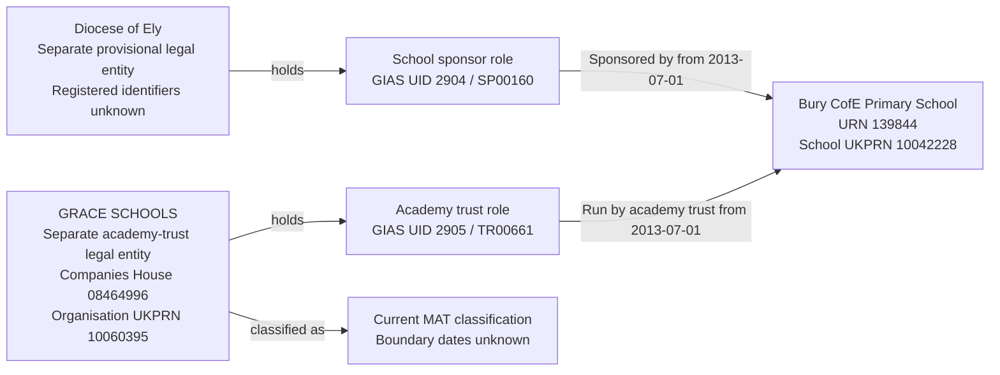

# T14R: URN 139844, Bury CofE Primary School

T14R tests that the Diocese of Ely holds an external sponsorship responsibility while GRACE SCHOOLS holds the academy-operating responsibility for Bury CofE Primary School. The two parties remain separate even though their current school portfolios and the selected responsibility start dates match.

The selected slice contains one establishment, two legal entities, two party roles and two current responsibilities. The Diocese of Ely is provisionally allocated from its source Group UID; its registered identity is not verified. The separate-party interpretation is the accepted mapping for this bounded test, not independent proof of the sponsor's registered legal identity.

## Establishment

| Field | Value |
| --- | --- |
| URN | 139844 |
| Name | Bury CofE Primary School |
| Establishment number | 3367 |
| Establishment type | Academy converter (34) |
| Education phase | Primary (2) |
| Local authority code | 873 |
| Source status | Open (1) |
| Establishment UKPRN | 10042228 |
| Open date | 2013-07-01 |
| Close date | Null |

The school is an academy converter in the source. Its separate sponsor link is retained; sponsorship does not change its establishment type to Academy sponsor led. The school UKPRN identifies the establishment, not either responsible party.

## Source group records

| Field | External sponsor | Academy trust |
| --- | --- | --- |
| Exact source name | Diocese of Ely | GRACE SCHOOLS |
| Group UID | 2904 | 2905 |
| Group ID | SP00160 | TR00661 |
| Source group type | School sponsor (05) | Multi-academy trust (06) |
| Companies House number | Null | 08464996 |
| Organisation UKPRN | Null | 10060395 |
| Source group open date | 1900-01-01T00:00:01 | 2013-03-27 |
| Source group closed date | Null | Null |
| Selected GroupLink ID | 3115 | 6303 |
| Link effective date | 2013-07-01 | 2013-07-01 |
| Link archived | 0 | 0 |
| Target party role | School sponsor | Academy trust |
| Target responsibility | Sponsored by | Run by academy trust |

These are the only two source group links for URN 139844. Both have non-placeholder effective dates and non-archived assertions, and both source groups have no closed date. No `GroupRelationsLink` involving either selected group was returned.

The sponsor has 24 links covering 24 distinct URNs, all non-archived. The trust has 25 links covering 25 distinct URNs: 24 non-archived and one archived. Their current URN sets are equal. Across all links, the trust has one additional URN. Those other establishments and the archived operating relationship are outside this case.

## Identity and date interpretation

Allocate the sponsor separately using its source Group UID 2904 and retain the accepted separate-party decision. Resolve the trust using its supplied Companies House number 08464996, checking consistency with organisation UKPRN 10060395 and any existing source-UID mapping. Never resolve either party through its name or its school portfolio alone.

Equal current URN sets show that the sponsor and trust have relationships with the same schools. They do not establish that the sponsor and trust are one legal entity. Different source group types describe different roles, but are not themselves proof of separate legal identities either. Registered sponsor identity remains subject to a migration decision. An existing ambiguous name match or conflicting identifier ownership must require review rather than a silent merge.

The sponsor's 1900-01-01 value is a placeholder. Preserve the raw source timestamp in migration evidence but do not use it as incorporation, party-role, classification or responsibility start. Its legal form, incorporation date, dissolution date, charity status, company number and organisation UKPRN remain unknown. Missing company identifiers do not establish that the sponsor is a person.

The two responsibility starts are 2013-07-01, from their respective links. Their end dates remain unknown. The school opens on the same date, but that does not establish either party-role start. The trust's source group open date is used as a source-derived incorporation mapping, not as the start of its Academy trust role or MAT classification.

## Relationship graph



The graph does not assert ownership, organisational membership or a corporate relationship between the sponsor and academy trust.

## Target interpretation

| Target table | Expected records for T14R |
| --- | --- |
| `establishment` and core substructures | One establishment, URN 139844, retaining its name, academy type, school UKPRN and lifecycle dates. |
| `legal_entity` | Two records with distinct UUIDs: provisional Diocese of Ely and Companies House-identified GRACE SCHOOLS. Shared links and matching responsibility dates do not consolidate them. |
| Legal form and company dates | Sponsor values remain unknown. The academy-trust mapping assumes Charitable company limited by guarantee and uses 2013-03-27 as source-derived incorporation date; dissolution date and charity status remain unknown. These assumptions are not fresh register verification. |
| `organisation_identifier` | Company number `08464996` and organisation UKPRN `10060395` belong only to GRACE SCHOOLS. No registered identifiers are invented for the sponsor. |
| `establishment_party_role` | One School sponsor role for the Diocese of Ely and one Academy trust role for GRACE SCHOOLS. Both have unknown start/end dates and no person holder. |
| `group_identifier` | UID `2904` and Group ID `SP00160` identify the sponsor role; UID `2905` and Group ID `TR00661` identify the academy-trust role. All four identifiers are current. |
| `academy_trust_classification` | One current Multi-academy trust classification on GRACE SCHOOLS, with unknown start/end dates. None on the sponsor. |
| `establishment_responsibility` | One current Sponsored by responsibility held by the Diocese of Ely, with no academy-trust type; one current Run by academy trust responsibility held by GRACE SCHOOLS, typed MAT. Both start on 2013-07-01 and have unknown ends. |
| `person`, `organisation_group`, `organisation_group_member` | No records created for the selected relationships. Shared portfolios are not organisation-group membership. |
| Migration evidence | Retain both source group assertions, GroupLinks 3115 and 6303, the sponsor's raw placeholder date and its rejection, and the bounded separate-party decision. Record provisional sponsor identity separately from the trust's supplied registered identifiers. |

## Evidence limits

The source supplies distinct sponsor and trust records and establishment links, but no registered identifier for the sponsor and no explicit group-to-group identity assertion. The separate-party mapping is accepted for this test. Actual migration must retain a recorded identity decision and must not present the provisional sponsor allocation as a verified registered company.

The selected current links support the two responsibilities. They do not verify all establishment fields, prove the parties' wider corporate relationship or establish the timing of either party role or MAT classification. Non-archived portfolio counts are observations, not certification of every unselected relationship. This case does not import the wider portfolios or the trust's archived link.

## Target query

```sql
SELECT e.urn, e.name AS establishment,
       le.legal_entity_id, le.name AS responsible_party,
       rt.name AS responsibility,
       r.start_date, r.end_date, r.is_current,
       trust_type.name AS responsibility_trust_type
FROM establishment.establishment e
JOIN establishment.establishment_responsibility r USING (establishment_id)
JOIN establishment.establishment_responsibility_type rt USING (responsibility_type_id)
JOIN establishment.legal_entity le USING (legal_entity_id)
LEFT JOIN establishment.academy_trust_type trust_type USING (academy_trust_type_id)
WHERE e.urn=139844
ORDER BY rt.name;
```

After migration, the expected result is two rows with different `legal_entity_id` values. Both responsibilities start on 2013-07-01 and are current; only Run by academy trust is typed MAT.

## Expected checks

- One establishment, two legal entities, two roles and two responsibilities exist for the selected slice.
- The sponsor and academy trust remain separate despite equal current school portfolios and matching responsibility start dates.
- Sponsor UID 2904 and Group ID SP00160 belong only to the School sponsor role; trust UID 2905 and Group ID TR00661 belong only to the Academy trust role.
- Company number 08464996 retains its leading zero and, with organisation UKPRN 10060395, belongs only to GRACE SCHOOLS.
- School UKPRN 10042228 remains on the establishment; no sponsor registered identifiers or person identity are invented.
- The sponsor's raw placeholder timestamp is retained in evidence and excluded from target business dates. Sponsor legal form, company dates and charity status remain unknown.
- Both responsibilities begin on 2013-07-01, have unknown ends and are current. The sponsor responsibility has no academy-trust type; the operating responsibility is typed MAT.
- Both party-role boundary dates and MAT-classification boundary dates remain unknown. Only the academy trust has a MAT classification.
- GroupLinks 3115 and 6303 and the accepted separate-party interpretation remain traceable. Provisional sponsor identity is distinguished from supplied trust identifiers.
- Sponsor-first and trust-first imports produce the same separate-party identities. Reimport creates no duplicate parties, roles, identifiers, classifications or responsibilities.
- An unresolved name collision or conflicting identifier owner requires review; neither shared establishment links nor equal portfolios authorise a merge.
- No unselected school, archived trust relationship, organisation-group membership or corporate relationship is imported.
