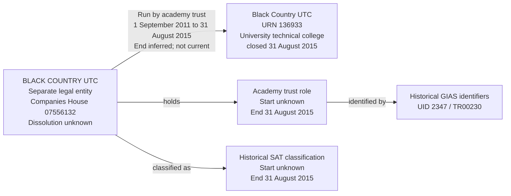

# T15R: URN 136933, Black Country UTC

T15R tests that a closed university technical college retains its historical operating responsibility to a closed single-academy trust. A non-archived source link must not make that responsibility current when both the establishment and trust group have recorded closure dates.

The selected slice contains one establishment, one legal entity, one Academy trust role, one SAT classification and one historical responsibility. It exercises closed SAT lifecycle mapping, preserves the original identifiers and distinguishes source-recorded closure from an inferred relationship end and an unknown company dissolution date.

## Establishment

| Field | Value |
| --- | --- |
| URN | 136933 |
| Name | Black Country UTC |
| Establishment number | 4000 |
| Establishment type | University technical college (40) |
| Establishment type group | Free schools |
| Education phase | Secondary (4) |
| Local authority code | 335 |
| Source status | Closed (2) |
| Establishment UKPRN | Null |
| Open date | 2011-09-01 |
| Close date | 2015-08-31 |

The UTC remains a separate establishment with its own URN. Its similar name does not make it the same record as the trust, and a missing school UKPRN is not a reason to copy an organisation identifier onto it.

## Source group and relationship

| Field | Source value |
| --- | --- |
| Exact trust-group name | BLACK COUNTRY UTC |
| Group UID | 2347 |
| Group ID | TR00230 |
| Source group type | Single-academy trust (10) |
| Companies House number | 07556132 |
| Organisation UKPRN | Null |
| Source group open date | 2011-03-08 |
| Source group closed date | 2015-08-31 |
| Source group local-authority code | 999 |
| Selected GroupLink ID | 5319 |
| Link effective date | 2011-09-01 |
| Link archived | 0 |
| Target party role | Academy trust |
| Target responsibility | Run by academy trust |

The local BAU source supplies exactly one GroupLink for URN 136933 and exactly one link for group 2347: GroupLink 5319. No `GroupRelationsLink` involving group 2347 was returned. The check for another group holding company number 07556132 or Group ID TR00230 returned only group 2347. These are bounded source observations, not independent confirmation of registered company status or an exhaustive search for successor establishments.

The inspected `GroupLink` table supplies an effective date and archived flag but no relationship end-date column. The link is still non-archived even though the establishment and trust group both record closure on 2015-08-31. Preserve that source assertion as evidence; do not rewrite it to make the dates and flag agree.

## Identity and date interpretation

Resolve the trust using supplied company number 07556132, retaining its leading zero and checking any existing source-UID or identifier mapping. Keep the establishment separate. Neither record supplies a UKPRN, so no school or organisation UKPRN is invented.

The accepted migration assumption for a company-identified academy trust is legal-entity type `Charitable company limited by guarantee`. Apply that assumption here and retain the source SAT type and company number as its basis. This is not independently verified registered legal form or charity status. Charity-register status remains unknown and can later be corrected using authoritative evidence.

The trust group's `openDate` of 2011-03-08 is the source-derived incorporation mapping for this case. It is not separately named as incorporation in BAU and has not been independently verified against Companies House. It does not establish when the Academy trust role or SAT classification began; those start dates remain unknown.

For this bounded case, map the matching closed SAT group and establishment to an Academy trust role and SAT classification ending on 2015-08-31. Retain the source group closure as the basis for those ends. This is an explicit role/classification lifecycle interpretation, not proof of the company's dissolution. The legal entity's `dissolution_date` remains unknown. Actual migration requires the lifecycle interpretation to be accepted and any conflicting evidence reviewed.

The operating responsibility starts on 2011-09-01 from GroupLink 5319. Infer its end as 2015-08-31 from the establishment's closure, recording `end_date_basis = inferred`. This end is an upper bound: the responsibility might have ended earlier, and BAU supplies no direct link-end date. Do not label it as an evidenced relationship end merely because the trust group closed on the same date.

The role and classification ends use the source group closure; the responsibility end uses the establishment closure. Their equal values do not make them the same fact. The target uses inclusive starts and exclusive ends, retaining the mapped closure value without adding a day.

Both the SAT classification and operating responsibility are historical (`is_current = false`). The closed group overrides the stale `archived = 0` indication when deciding current responsibility state. GIAS UID 2347 and Group ID TR00230 remain resolvable on the Academy trust role, with issuer GIAS and `is_current = false`.

## Relationship graph



## Expected target representation

| Target table | Expected records for T15R |
| --- | --- |
| `establishment` and lifecycle | One UTC, URN 136933, retaining type 40, unknown UKPRN, opening 2011-09-01 and closure 2015-08-31. |
| `legal_entity` | One BLACK COUNTRY UTC legal entity, source-derived incorporation 2011-03-08, assumed type Charitable company limited by guarantee and unknown dissolution and charity-register status. The legal form is a migration assumption, not independently verified from the group type. |
| `organisation_identifier` | One Companies House identifier 07556132 on the legal entity. No organisation UKPRN is invented. |
| `establishment_party_role` | One Academy trust role with unknown start and end 2015-08-31, based on the accepted group-closure interpretation. |
| `academy_trust_classification` | One SAT classification with unknown start, end 2015-08-31 and `is_current = false`. No MAT classification or SAT-to-MAT transition is invented. |
| `establishment_responsibility` | One Run by academy trust responsibility, typed SAT, from 2011-09-01 to 2015-08-31, with `is_current = false`. |
| `group_identifier` | GIAS Group UID 2347 and Group ID TR00230 on the Academy trust role, both historical and both issued by GIAS. |
| Migration evidence | Retain GroupLink 5319, its effective date and original `archived = 0`, the two source closure assertions, the accepted lifecycle interpretation and the inferred responsibility-end basis. |
| `person`, sponsor responsibility and `organisation_group_member` | No records created merely to represent the SAT, UTC or their operating relationship. |

## Evidence limits

Closure of the UTC and its GIAS SAT group does not establish that the company dissolved, that its registered legal form changed, or that there was no successor elsewhere. No successor relationship is asserted from the inspected group records. The case does not import another establishment or create a replacement company, party role or MAT classification.

The source supplies valid, non-placeholder dates for the selected lifecycle assertions. That does not certify every establishment field. The inferred responsibility end and source-derived incorporation date must remain distinguishable from independently evidenced business facts.

## Target query

```sql
SELECT e.urn, e.name AS establishment,
       le.name AS responsible_party,
       le.incorporation_date, le.dissolution_date,
       rt.name AS responsibility, trust_type.name AS responsibility_trust_type,
       r.start_date, r.end_date, r.is_current
FROM establishment.establishment e
JOIN establishment.establishment_responsibility r USING (establishment_id)
JOIN establishment.establishment_responsibility_type rt USING (responsibility_type_id)
JOIN establishment.legal_entity le USING (legal_entity_id)
JOIN establishment.academy_trust_type trust_type USING (academy_trust_type_id)
WHERE e.urn=136933;
```

After migration, the expected result is one historical Run by academy trust row typed SAT, starting 2011-09-01 and ending 2015-08-31. Incorporation is mapped to 2011-03-08; dissolution is null.

## Expected checks

- Exactly one selected UTC, legal entity, Academy trust role, SAT classification and operating responsibility exist.
- Company number 07556132 retains its leading zero and belongs to the legal entity, not the establishment.
- Both UKPRNs remain unknown; group local-authority code 999 does not replace the establishment's code 335 or assert ownership by a local authority.
- The source group open date is retained as the source-derived incorporation mapping, not copied to the role or classification start.
- The legal-entity type is Charitable company limited by guarantee under the explicit migration assumption; charity-register status remains unknown.
- The role and SAT classification end on 2015-08-31 under the accepted lifecycle mapping; their starts and company dissolution remain unknown.
- The operating responsibility starts from GroupLink 5319 and ends at the establishment-closure upper bound, with `end_date_basis = inferred`.
- The source's `archived = 0` is retained, but neither the SAT classification nor operating responsibility is current.
- Historical UID 2347 and Group ID TR00230 remain resolvable on the Academy trust role with issuer GIAS.
- No company dissolution, successor, sponsor, MAT transition or organisation-group membership is invented.
- Reimport preserves party, role, classification, identifier and responsibility identities without duplicate records or a revived current relationship.
- Conflicting identifier ownership or lifecycle evidence requires review rather than silent reassignment or date correction.
