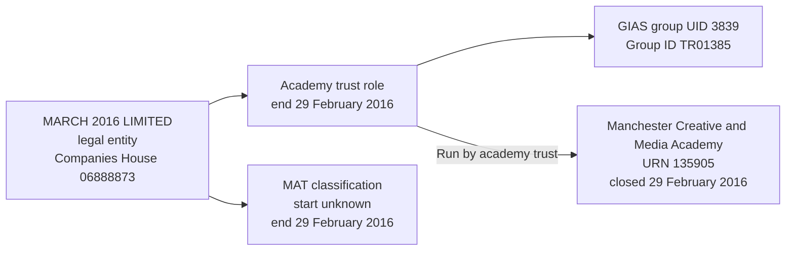

# T16: URN 135905, Manchester Creative and Media Academy

T16 tests that Manchester Creative and Media Academy's historical operating responsibility to MARCH 2016 LIMITED is retained, with its end date inferred from the academy's closure and the inference recorded as migration evidence.

## Establishment

| Field | Value |
| --- | --- |
| URN | 135905 |
| Establishment name | Manchester Creative and Media Academy |
| Establishment number | 6910 |
| Source establishment type | Academy sponsor led (28), mapped to target Mainstream academy |
| Education phase | Secondary (4 in BAU) |
| Local authority code | 352 |
| Source establishment status | Closed (2) |
| Establishment UKPRN | Null |
| Establishment open date | 2009-09-01 |
| Related legal entity | MARCH 2016 LIMITED |
| Companies House number | 06888873 |
| GIAS group UID | 3839 |
| Group ID | TR01385 |
| Organisation UKPRN | Null |
| Source group type | Multi-academy trust |
| Source group status | Closed |
| Academy closure date | 29 February 2016 |
| Legal-entity incorporation date | 27 April 2009, from the BAU trust-group `openDate` field |

## T16 group record

| Source group | Source type | Source status | Effective date | Target role | Target responsibility | Group ID | Companies House number |
| ---: | --- | --- | --- | --- | --- | --- | --- |
| 3839 | Multi-academy trust | Closed | 1 September 2009 | Academy trust | Run by academy trust | TR01385 | 06888873 |

The selected GroupLink is 6647, with `archived = 0` and `effectiveDate = 2009-09-01`. This is the only link held by group 3839. The source trust-group `closedDate` and establishment `CloseDate` both equal 2016-02-29. No `GroupRelationsLink` involving 3839 was returned, and no other group held company number 06888873 or Group ID TR01385 in the inspected source copy.

## Other source links and scope

The establishment has three source group links in total. Only the trust link is selected for this case.

| GroupLink | Source group | Source role | Archived | Effective date | Treatment |
| --- | --- | --- | --- | --- | --- |
| 6647 | 3839, MARCH 2016 LIMITED | Multi-academy trust | 0 | 2009-09-01 | Import the historical operating responsibility. |
| 4014 | 4992, The Manchester College | School sponsor | 1 | 2009-09-01 | Outside this case; sponsor identity and archived-link history require separate assessment. |
| 21588 | 15909, narrative co-sponsored-academy comment | School sponsor | 0 | 2015-11-23 | Outside this case; the source name is commentary, not an identified sponsor party. Do not create a legal entity from it. |

Group 4992 supplies SP00342 but no company number or UKPRN, and its open timestamp is the placeholder 1900-01-01T00:00:01. Group 15909 has no Group ID, company number or UKPRN. Its exact name is "This is a co-sponsored academy. Details of the sponsors of co-sponsored academies are not included in the current version of performance tables but this information will be available early in 2016". These observations explain the exclusions; they do not resolve either sponsor's identity or create sponsorship responsibilities.

## Identity and date interpretation

T16 exercises a stale group link. MARCH 2016 LIMITED and its only academy, Manchester Creative and Media Academy, both close on 29 February 2016, but the BAU group link does not carry a relationship end date. The target must therefore preserve the source group and infer the end of the establishment responsibility from the academy's closure.

The local BAU test database directly supplies the group name, Companies House number `06888873` and group `openDate` of `2009-04-27`. For academy-trust group types, the migration treats that local-copy `openDate` as the incorporated-on date. The local `dbo.EstablishmentGroup` table does not contain a separately named `incorporation_date` column, so the semantic mapping should remain explicit.

The inferred date is an upper bound: the relationship may have ended earlier. It is not an evidenced group-link end date.

The existing migration assumption classifies a Companies House-identified academy trust as a Charitable company limited by guarantee. Apply that assumption here, retaining the supplied company number and MAT group type as its basis. It is not independent verification of registered legal form or charity-register status. Charity status and company dissolution remain unknown.

Role and MAT-classification ends use the recorded trust-group closure; the operating responsibility end is inferred from the establishment closure. Their equal values do not make their evidence bases interchangeable. Role and classification starts remain unknown. Target periods have inclusive starts and exclusive ends, using the mapped closure value without adding a day.

The classification, responsibility, Group UID and Group ID are historical. The stale `archived = 0` value is retained in migration evidence but cannot override the closed trust-group state to make the responsibility current. The Companies House identifier remains attached to the legal entity; historical role identifiers remain resolvable. Neither missing UKPRN is filled from another record.

## Expected target representation

The migration should create:

- One establishment row for URN `135905`, with its original lifecycle and unknown UKPRN;
- One legal entity for MARCH 2016 LIMITED, with Companies House number `06888873`, source-derived incorporation date `2009-04-27`, assumed charitable-company type and unknown dissolution and charity-register status;
- One academy-trust party role for the legal entity, with an unknown start date and an evidenced end date of `2016-02-29`;
- One historical MAT classification for the legal entity, with an unknown start date and an end date of `2016-02-29`;
- One historical `Run by academy trust` responsibility for URN `135905`, beginning on `2009-09-01` and ending on `2016-02-29`;
- `end_date_basis = inferred` on the responsibility, because the end is derived from the academy's closure rather than supplied by the BAU group link; and
- GIAS group UID `3839` and Group ID `TR01385`, both issued by GIAS, attached to the academy-trust role with `is_current = false`.

The legal entity, role, classification and responsibility are separate facts. The closure of the establishment ends the inferred operating responsibility; it does not by itself prove when the company was dissolved or when the legal entity's academy-trust role ended in the source.

## Relationship graph



## Target query

```sql
SELECT e.urn, e.name AS establishment,
       le.name AS responsible_party,
       le.incorporation_date, le.dissolution_date,
       rt.name AS responsibility, trust_type.name AS responsibility_trust_type,
       r.start_date, r.end_date, r.is_current
FROM establishment.establishment e
JOIN establishment.establishment_responsibility r USING (establishment_id)
JOIN establishment.establishment_responsibility_type rt USING (responsibility_type_id)
JOIN establishment.legal_entity le USING (legal_entity_id)
JOIN establishment.academy_trust_type trust_type USING (academy_trust_type_id)
WHERE e.urn=135905;
```

The expected result is one historical Run by academy trust row for MARCH 2016 LIMITED, typed Multi-academy trust, starting 2009-09-01 and ending 2016-02-29, with `is_current = false`. Incorporation is mapped to 2009-04-27; dissolution is null. The responsibility end is inferred from establishment closure, not supplied as a GroupLink end date.

## Validation expectations

The migration validation should confirm:

- Exactly one establishment row for URN `135905`;
- Exactly one legal entity and one academy-trust role for MARCH 2016 LIMITED;
- One MAT classification with `is_current = false`;
- One `Run by academy trust` responsibility with the `2009-09-01` start date, `2016-02-29` end date and inferred end-date basis;
- Both historical GIAS identifiers on the academy-trust role: UID `3839` and Group ID `TR01385`;
- Source GroupLink 6647, `archived = 0`, the two closure assertions and their distinct evidence bases remain traceable;
- Company number 06888873 retains its leading zero, both UKPRNs remain unknown, and no company dissolution date is invented;
- The two unselected sponsor links create no party, role or responsibility, and narrative commentary is not treated as a legal entity;
- No organisation-group membership is created to restate the trust's operating responsibility; and
- Repeat import retains existing establishment, party, role, classification, identifier and responsibility identities without duplicates.

This case is the closed-lifecycle regression case for the groups model. It tests inferred responsibility end dates and identifier retention; it does not establish a company dissolution date or a complete legal-entity closure history.
