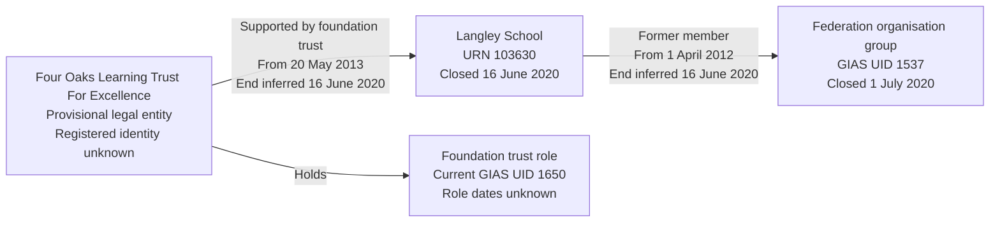

# T17: URN 103630, Langley School

T17 tests that one establishment can have federation membership and a foundation-trust support responsibility at the same time. These are different relationships: the federation is a non-legal organisation group, while the foundation trust is a separately allocated legal entity holding a Foundation trust role.

The local source makes this a historical case. Langley School closed before the federation closed; its foundation-support link still has a non-archived flag. Preserve those facts rather than presenting either relationship as current.

## Establishment

| Field | Source value |
| --- | --- |
| URN | 103630 |
| Name | Langley School |
| Establishment number | 7060 |
| Establishment type | Foundation special school (12) |
| Establishment type group | Local authority maintained schools |
| Local authority code | 330 |
| Education phase | Not applicable (source code 0) |
| Establishment UKPRN | 10077032 |
| Source status | Closed (2) |
| Open date | Null |
| Close date | 2020-06-16 |

The school opening date remains unknown. Neither group formation nor a link effective date is substituted for it. The school UKPRN belongs to the establishment, not the trust or federation.

## Source groups and links

| Field | Federation | Foundation trust |
| --- | --- | --- |
| Exact name | The Federation of Beaufort School and Langley School | Four Oaks Learning Trust For Excellence |
| Group UID | 1537 | 1650 |
| Source type | Federation (01) | Foundation trust (02) |
| Group ID | Null | Null |
| Companies House number | Null | Null |
| Organisation UKPRN | Null | Null |
| Group open date | 2012-04-01 | 2013-05-20 |
| Group closed date | 2020-07-01 | Null |
| Group local-authority code | 999 | 999 |
| Langley GroupLink | 1245 | 1572 |
| Effective date | 2012-04-01 | 2013-05-20 |
| Archived | 1 | 0 |
| Link type | HARD | Null |

These are Langley's only two source group links. The federation has two links, both archived: Langley 103630 / link 1245 and Beaufort School 103627 / link 1246, both effective 2012-04-01. Beaufort is open in the source, with no recorded establishment closure. The foundation trust has seven links to seven distinct establishments. No `GroupRelationsLink` involving either selected group was returned.

Only Langley and its two relationships are imported. Beaufort and the trust's other schools are not additional fixture establishments. The target therefore contains a selected historical membership slice, not the federation's complete former portfolio. Its evidence must retain that partial scope. An open federation requires at least two members; this selected federation is closed and is not represented as having one current member.

## Identity and date interpretation

Create a Federation organisation group for UID 1537, with recorded formation 2012-04-01 and closure 2020-07-01. It is not a legal entity and creates no operating responsibility. Do not assign a single local-authority owner to the federation from code 999 or the school's authority.

Allocate Four Oaks Learning Trust For Excellence provisionally through source UID 1650, unless an existing accepted mapping already resolves it. The source supplies no registered identifiers, so its legal form, charity-register status, incorporation and dissolution remain unknown. A name match alone must not authorise merging with an existing party. Actual migration requires review of registered trust identity and legal form.

The foundation trust's source group opening date is not a company incorporation date or Foundation trust role start. Role boundaries remain unknown. Its group remains open and UID 1650 remains current even though its support of Langley is historical. No SAT or MAT classification is created.

Langley's federation membership starts on 2012-04-01 from link 1245. Infer its leaving date as 2020-06-16, the earlier of the known school and federation closures. Record `left_date_basis = inferred`. This is an upper bound, not a source GroupLink end date: membership might have ended earlier. Retain the archived flag without pretending it supplies an exact leaving date.

The foundation-support responsibility starts on 2013-05-20 from link 1572. Infer its end as the school-closure upper bound 2020-06-16, with `end_date_basis = inferred`. For this bounded case it is not current, despite the source `archived = 0`. Retain the contradictory flag and the case-specific closure interpretation in evidence; do not retire the trust's role or identifiers merely because this school closed. This interpretation is not a general rule silently changing other source relationships.

Target periods use inclusive starts and exclusive ends. The inferred closure values are retained without adding a day. The relationships overlap from 2013-05-20 until the shared closure upper bound, but uncertain business ends remain explicitly inferred.

## Relationship graph



## Expected target representation

| Target table | Expected records |
| --- | --- |
| `establishment` and lifecycle | One Langley School, retaining school UKPRN 10077032, unknown opening and closure 2020-06-16. |
| `organisation_group` | One closed federation, with formation 2012-04-01, closure 2020-07-01 and no local-authority owner. |
| `organisation_group_member` | One selected historical Langley membership, joined 2012-04-01 and inferred left date 2020-06-16. Lead flag is null. |
| `legal_entity` | One provisional Four Oaks Learning Trust For Excellence, with unknown registered legal form, charity status and company dates. |
| `establishment_party_role` | One Foundation trust role with unknown boundaries. |
| `establishment_responsibility` | One historical Supported by foundation trust responsibility, from 2013-05-20 to inferred end 2020-06-16, not current and with no academy-trust type. |
| `group_identifier` | Historical GIAS UID 1537 on the federation and current GIAS UID 1650 on the Foundation trust role. No Group IDs are invented. |
| Migration evidence | Retain links 1245/1572, their different archived flags, membership partial scope, the provisional identity decision and the distinct inferred-end bases. |
| Organisation identifiers, academy-trust classifications and lead periods | No records created merely for either relationship. |

## Target query

```sql
SELECT e.urn, 'Federation membership' AS relationship,
       g.name AS related_party_or_group,
       m.joined_date AS start_date, m.left_date AS end_date
FROM establishment.establishment e
JOIN establishment.organisation_group_member m USING (establishment_id)
JOIN establishment.organisation_group g USING (organisation_group_id)
WHERE e.urn=103630
UNION ALL
SELECT e.urn, rt.name, le.name, r.start_date, r.end_date
FROM establishment.establishment e
JOIN establishment.establishment_responsibility r USING (establishment_id)
JOIN establishment.establishment_responsibility_type rt USING (responsibility_type_id)
JOIN establishment.legal_entity le USING (legal_entity_id)
WHERE e.urn=103630
ORDER BY relationship;
```

The expected result is two rows: federation membership from 2012-04-01 and foundation support from 2013-05-20, both ending at the inferred upper bound 2020-06-16. Federation membership is not also returned as an operating responsibility.

## Expected checks and evidence limits

- One school has exactly one selected membership and one separate support responsibility; neither relationship replaces the other.
- Federation UID 1537 belongs to an organisation group; trust UID 1650 belongs to a Foundation trust role. Their historical/current identifier states differ deliberately.
- School UKPRN 10077032 is not copied to either group or party. Missing company numbers and Group IDs remain absent.
- The earlier school closure bounds membership, rather than copying the later federation closure to Langley's leaving date.
- Both relationship ends are labelled inferred. Source archived flags 1 and 0 remain traceable, but do not establish exact end dates or a current support relationship.
- The open trust's role and identifiers are not retired because Langley closed; company dissolution and registered trust identity are not invented.
- Beaufort and the trust's wider portfolio are not imported. Historical partial membership is explicitly recorded.
- Reimport retains establishment, federation, membership, party, role, identifiers and responsibility identities without duplication.
- A conflicting source UID, unresolved name match or changed lifecycle assertion requires review. These selected assertions do not certify every source field or approve a production registered-identity mapping.
