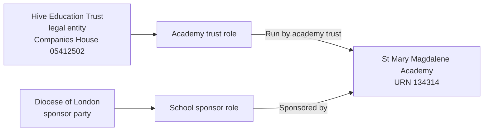

# T2: URN 134314, St Mary Magdalene Academy

## Establishment

| Field | Value |
| --- | --- |
| URN | 134314 |
| Establishment number | 6905 |
| Name | St Mary Magdalene Academy |
| Establishment type | Academy sponsor led |
| Education phase | All-through |
| Local authority | Islington |

## Group records

| Source group | Source type | Source status | Effective date | Target role | Target responsibility | Group ID | Companies House number |
| ---: | --- | --- | --- | --- | --- | --- | --- |
| 4737 | Single-academy trust | Archived | 1 September 2007 | Academy trust | Run by academy trust | TR02103 | 05412502 |
| 23869 | Multi-academy trust | Active | 4 October 2021 | Academy trust | Run by academy trust | TR02103 | 05412502 |
| 2914 | School sponsor | Active | 1 September 2007 | School sponsor | Sponsored by | SP00172 | Not supplied |

T2 demonstrates two things. First, Hive Education Trust changed from a
single-academy trust to a multi-academy trust. The archived SAT group `4737`
and active MAT group `23869` represent successive classifications of the same
trust and must not be treated as two legal entities. Second, the party
providing sponsorship is different from the party running the academy. The
external sponsor is the Diocese of London, which can sponsor establishments
that are run by another trust. These are separate parties, roles and
responsibilities for the same establishment.

The current local BAU source link for the sponsor starts on 1 September 2007.
The active academy-trust link starts on 4 October 2021. The sponsor record does not
include a Companies House number, so identity resolution must not merge it
with Hive Education Trust merely because both records are linked to this
establishment.

## Relationship graph

## Expected target representation

The migration should create:

- one establishment row for URN `134314`;
- one legal entity and academy-trust role for Hive Education Trust;
- two academy-trust classification periods for that role: SAT from 1 September
  2007 to 3 October 2021, and MAT from 4 October 2021 onward. The SAT end
  date is inferred as the day before the successor MAT link starts;
- one legal entity and school-sponsor role for the Diocese of London;
- dated `Run by academy trust` responsibility history covering the SAT and MAT
  periods; and
- one `Sponsored by` responsibility beginning 1 September 2007.

The two responsibilities must remain distinguishable even though they refer to
the same establishment. The sponsor's missing Companies House number should be
retained as missing rather than invented or copied from the academy trust.
