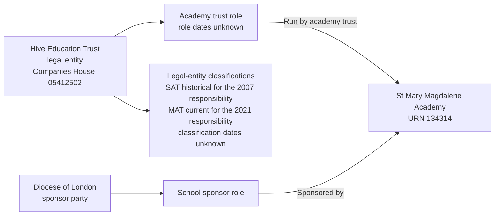

# T2: URN 134314, St Mary Magdalene Academy

## Establishment

| Field | Value |
| --- | --- |
| URN | 134314 |
| Establishment number | 6905 |
| Name | St Mary Magdalene Academy |
| Establishment type | Academy sponsor led |
| Education phase | All-through |
| Local authority | Islington |

## Group records

| Source group | Source type | Source status | Effective date | Target role | Target responsibility | Group ID | Companies House number |
| ---: | --- | --- | --- | --- | --- | --- | --- |
| 4737 | Single-academy trust | Archived | 1 September 2007 | Academy trust | Run by academy trust | TR02103 | 05412502 |
| 23869 | Multi-academy trust | Active | 4 October 2021 | Academy trust | Run by academy trust | TR02103 | 05412502 |
| 2914 | School sponsor | Active | 1 September 2007 | School sponsor | Sponsored by | SP00172 | Not supplied |

T2 demonstrates two things. First, Hive Education Trust changed from a single-academy trust to a multi-academy trust. The archived SAT group `4737` and active MAT group `23869` represent successive classifications of the same trust and must not be treated as two legal entities. Second, the party providing sponsorship is different from the party running the academy. The external sponsor is the Diocese of London, which can sponsor establishments that are run by another trust. These are separate parties, roles and responsibilities for the same establishment.

The current local BAU source link for the sponsor starts on 1 September 2007. The active academy-trust link starts on 4 October 2021. The sponsor record does not include a Companies House number, so identity resolution must not merge it with Hive Education Trust merely because both records are linked to this establishment.

The source does not provide dates for the legal entities' party roles or trust classifications, so those start and end dates are `NULL`. The group-link dates belong to the establishment responsibilities. They show that Hive Education Trust was a SAT when the responsibility beginning 1 September 2007 applied, and a MAT when the responsibility beginning 4 October 2021 applied. They do not establish when either classification itself started or ended.

The active MAT group makes the MAT responsibility and the MAT classification current. The archived SAT group makes the SAT responsibility and SAT classification historical. This current-state assertion is explicit; it is not derived from the dates.

## Relationship graph

## Expected target representation

The migration should create:

- one establishment row for URN `134314`;
- one legal entity and academy-trust role for Hive Education Trust;
- SAT and MAT classifications for Hive Education Trust, both with `NULL` start and end dates. The SAT classification has `is_current = false`; the MAT classification has `is_current = true`;
- one legal entity and school-sponsor role for the Diocese of London;
- two `Run by academy trust` responsibilities: SAT from 1 September 2007 with an unknown end date and `is_current = false`, and MAT from 4 October 2021 with an unknown end date and `is_current = true`;
- one `Sponsored by` responsibility beginning 1 September 2007, with no academy-trust type and `is_current = true`.

The two responsibilities must remain distinguishable even though they refer to the same establishment. The sponsor's missing Companies House number should be retained as missing rather than invented or copied from the academy trust.
