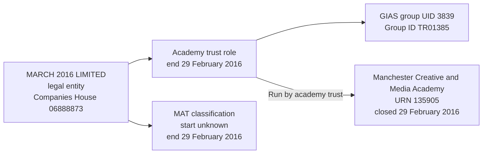

# T20: URN 135905, Manchester Creative and Media Academy

## Establishment

| Field | Value |
| --- | --- |
| URN | 135905 |
| Establishment name | Manchester Creative and Media Academy |
| Related legal entity | MARCH 2016 LIMITED |
| Companies House number | 06888873 |
| GIAS group UID | 3839 |
| Group ID | TR01385 |
| Source group type | Multi-academy trust |
| Source group status | Closed |
| Academy closure date | 29 February 2016 |
| Legal-entity incorporation date | 27 April 2009, from the BAU trust-group `openDate` field |

## T20 group record

| Source group | Source type | Source status | Effective date | Target role | Target responsibility | Group ID | Companies House number |
| ---: | --- | --- | --- | --- | --- | --- | --- |
| 3839 | Multi-academy trust | Closed | 1 September 2009 | Academy trust | Run by academy trust | TR01385 | 06888873 |

T20 exercises a stale group link. MARCH 2016 LIMITED and its only academy,
Manchester Creative and Media Academy, both close on 29 February 2016, but the
BAU group link does not carry a relationship end date. The target must therefore
preserve the source group and infer the end of the establishment responsibility
from the academy's closure.

The local BAU test database directly supplies the group name, Companies House
number `06888873` and group `openDate` of `2009-04-27`. For academy-trust group
types, the migration treats that local-copy `openDate` as the incorporated-on
date. The local `dbo.EstablishmentGroup` table does not contain a separately named
`incorporation_date` column, so the semantic mapping should remain explicit.

The inferred date is an upper bound: the relationship may have ended earlier.
The exact half-open date convention remains subject to the source-date decision;
this case records the inference explicitly rather than presenting it as an
evidenced link end.

## Expected target representation

The migration should create:

- one establishment row for URN `135905`;
- one legal entity for MARCH 2016 LIMITED, with Companies House number
  `06888873` and incorporation date `2009-04-27`;
- one academy-trust party role for the legal entity, with an unknown start date
  and an evidenced end date of `2016-02-29`;
- one MAT classification for the legal entity, with an unknown start date and
  an end date of `2016-02-29`;
- one `Run by academy trust` responsibility for URN `135905`, beginning on
  `2009-09-01` and ending on `2016-02-29`;
- `end_date_basis = inferred` on the responsibility, because the end is derived
  from the academy's closure rather than supplied by the BAU group link; and
- GIAS group UID `3839` and Group ID `TR01385`, both issued by GIAS, attached to
  the academy-trust role.

The legal entity, role, classification and responsibility are separate facts.
The closure of the establishment ends the inferred operating responsibility; it
does not by itself prove when the company was dissolved or when the legal
entity's academy-trust role ended in the source.

## Relationship graph

## Validation expectations

The migration validation should confirm:

- exactly one establishment row for URN `135905`;
- exactly one legal entity and one academy-trust role for MARCH 2016 LIMITED;
- one MAT classification with `is_current = false`;
- one `Run by academy trust` responsibility with the `2009-09-01` start date,
  `2016-02-29` end date and inferred end-date basis; and
- both GIAS identifiers on the academy-trust role: UID `3839` and Group ID
  `TR01385`.

This case is the closed-lifecycle regression case for the groups model. It
tests inferred responsibility end dates and identifier retention; it does not
establish a company dissolution date or a complete legal-entity closure
history.
