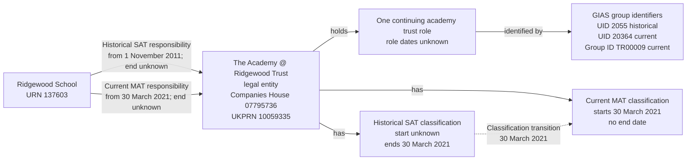

# T3 — Ridgewood School

T3 tests that Ridgewood School's trust remains one legal entity as it changes from SAT to MAT, with the trust's classification periods recorded separately from its responsibilities for the school.

## Establishment

| Field | Value |
| --- | --- |
| Test case | T3 |
| URN | 137603 |
| Establishment name | Ridgewood School |
| Establishment type | Academy converter (source type 34) |
| Source status | Open (status 1) |
| Open date | 1 November 2011 |
| Close date | Null |

## Local source evidence

Ridgewood School is the selected local case for T3.

| Field | Predecessor SAT | Successor MAT |
| --- | --- | --- |
| Group UID | 2055 | 20364 |
| Group ID | TR00009 | TR00009 |
| Name | THE ACADEMY @ RIDGEWOOD TRUST | THE ACADEMY @ RIDGEWOOD TRUST |
| Type code | 10 | 06 |
| Companies House number | Null | 07795736 |
| UKPRN | 10059335 | 10059335 |
| Source group open date | 3 October 2011 | 3 October 2011 |
| Source group closed date | 30 March 2021 | Null |
| GroupLink ID | 4778 | 34277 |
| Link effective date | 1 November 2011 | 30 March 2021 |
| Link archived | 1 | 0 |

The identity search by Group ID, Companies House number or UKPRN returned exactly these two group records. The query for all links to URN 137603 returned exactly these two links. Only one current academy-trust link exists for this establishment.

`GroupRelationsLink` explicitly records the conversion:

| Relationship ID | linking_group | linked_group | Type | establishedDate | systemLinkDate |
| --- | --- | --- | --- | --- | --- |
| 547 | 2055 | 20364 | 1M — Successor MAT | 2021-03-30 | 2021-03-30 |
| 548 | 20364 | 2055 | 1S — Predecessor SAT | 2021-03-30 | 2021-03-30 |

The type names were verified against `dbo.GroupLinkType`. The transition date is supported by the explicit relationship records, SAT closure and MAT link effective date; it is not derived from the closure date alone.

## Relationship graph

The classification changes within the same legal entity. Its academy-trust role continues, while its responsibility for Ridgewood School is recorded as separate SAT and MAT periods. Their dates are independent of the classification dates.

## Target interpretation

T3 can exercise one resolved legal entity, one continuing academy-trust role, historical SAT UID 2055, current MAT UID 20364 and shared Group ID TR00009. The MAT record supplies Companies House number 07795736; the matching UKPRN, Group ID, dates and explicit predecessor/successor relationships support consolidation.

The historical SAT responsibility starts on 1 November 2011, from GroupLink 4778. Its end date is unknown and it is not current because that link is archived. The current MAT responsibility starts on 30 March 2021, from GroupLink 34277, with an unknown end date. Both responsibilities point to the same legal entity: the classification change is not a new legal operator. Each responsibility retains its own source-link migration evidence.

| Record | Start date | End date | Current |
| --- | --- | --- | --- |
| SAT responsibility for Ridgewood School | 2011-11-01 | Unknown | No |
| MAT responsibility for Ridgewood School | 2021-03-30 | Unknown | Yes |
| SAT classification of the trust | Unknown | 2021-03-30 | No |
| MAT classification of the trust | 2021-03-30 | Unknown | Yes |

The historical SAT classification ends at the transition on 30 March 2021 and the current MAT classification starts at that transition. The initial SAT classification start remains unknown: neither incorporation nor the establishment link alone establishes when that classification began. The source SAT closure does not end the continuing legal entity or academy-trust role, and its classification end date is not copied into the SAT responsibility's end date. The MAT responsibility and classification start dates coincide because each is supported by its own evidence, not because one is derived from the other.

No structural DQ concern was identified in these checks. This assessment concerns the local fixture evidence, rather than independent verification of the live trust's history.

