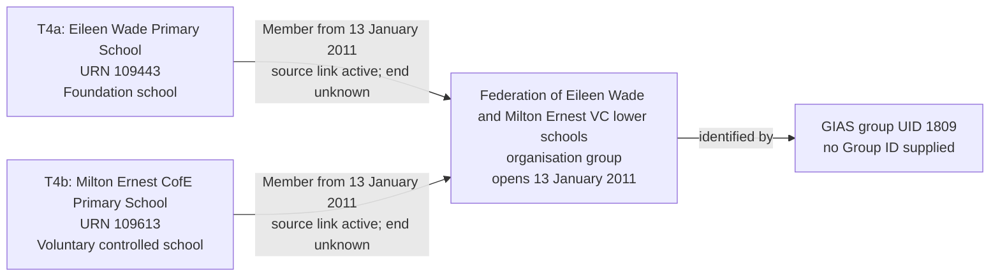

# T4 — Federation of Eileen Wade and Milton Ernest

T4 tests that Eileen Wade Primary School and Milton Ernest CofE Primary School are recorded as members of one federation, without creating a legal entity or operating responsibility for the federation.

## Establishments

T4 is one federation scenario with two establishment records: T4a and T4b.

| Field | T4a | T4b |
| --- | --- | --- |
| URN | 109443 | 109613 |
| Establishment name | Eileen Wade Primary School | Milton Ernest CofE Primary School |
| Establishment type | Foundation school (source code 05) | Voluntary controlled school (source code 03) |
| Education phase | Primary | Primary |
| Source status | Open (status 1) | Open (status 1) |
| Establishment open date | Unknown | Unknown |
| Establishment close date | Unknown | Unknown |

## Local source evidence

The local source records federation UID 1809 with exactly two membership links, both active. Its recorded name is `Federation of Eileen Wade and Milton Ernest VC lower schools`.

| Federation field | Source value |
| --- | --- |
| Group UID | 1809 |
| Group ID | Null |
| Group type | Federation (source code 01) |
| Open date | 2011-01-13 |
| Closed date | Null |
| Companies House number | Null |
| UKPRN | Null |

| Source GroupLink ID | Member URN | Effective date | Archived | Link type |
| --- | --- | --- | --- | --- |
| 1928 | 109443 | 2011-01-13 | 0 | HARD |
| 1929 | 109613 | 2011-01-13 | 0 | HARD |

Both memberships start on 13 January 2011, as recorded by their own link effective dates. Those dates happen to match the federation's open date; they are not copied from it. Neither link supplies a membership end date. The null establishment open dates are not replaced with the membership dates.

## Relationship graph



This graph shows the federation slice only. Membership is not a `run_by_academy_trust` or `supported_by_foundation_trust` responsibility.

## Target interpretation

T4 contains two establishment records, federation UID 1809 and both memberships. The separate foundation-trust relationship is outside the federation slice.

| Target table | Expected records for the federation slice |
| --- | --- |
| `establishment` | Two separate establishments, URNs 109443 and 109613. |
| `organisation_group` | One federation, using the local source name, `open_date = 2011-01-13` and unknown `close_date`. |
| `organisation_group_member` | Two members, each with `joined_date = 2011-01-13`, unknown `left_date` and null `is_lead_member`. |
| `group_identifier` | One GIAS Group UID value `1809`, attached to the organisation group. No Group ID row is created. |
| `legal_entity`, `organisation_identifier`, `establishment_party_role`, `academy_trust_classification`, `establishment_responsibility` | No records created merely to represent this federation or its memberships. |
| Migration evidence | Retain both source links and their active state, with separate member-evidence records beneath the rebuild run. |

The federation is an organisation group, not a legal entity. Its members are establishments. The absent company number and UKPRN are not missing federation identifiers that must be manufactured. `is_lead_member` is not applicable to a federation.

The active source links establish the observed current membership, but a null `left_date` does not prove that the membership lasts indefinitely. Preserve the source assertion in migration evidence without inventing a historical end date.

## Other source relationship

Eileen Wade Primary School also has GroupLink 171 to trust UID 1094, `North Bedfordshire Schools Trust (NBST)`, effective from 1 September 2008. This is a separate foundation-trust responsibility, not another federation membership. The trust record has a closed date of 31 March 2013 while the link is not archived. That date/status discrepancy requires separate assessment before migrating that responsibility; it must not be silently treated as current or used to invent its responsibility end date. Milton Ernest has no additional group link in the returned local records.

T4 tests the federation and its two memberships. It does not establish that every other relationship held by these establishments is clean or included in this slice.

## Target query

```sql
SELECT e.urn, e.name AS establishment_name,
       g.organisation_group_id, g.name AS federation_name,
       i.value AS gias_group_uid, m.joined_date, m.left_date
FROM establishment.organisation_group g
JOIN establishment.group_identifier i USING (organisation_group_id)
JOIN establishment.group_identifier_type t USING (group_identifier_type_id)
JOIN establishment.group_identifier_issuer issuer USING (group_identifier_issuer_id)
JOIN establishment.organisation_group_member m USING (organisation_group_id)
JOIN establishment.establishment e USING (establishment_id)
WHERE t.name = 'Group UID' AND issuer.name = 'GIAS' AND i.value = '1809'
ORDER BY e.urn;
```

## Expected checks

- Both establishments are represented by their own rows.
- UID 1809 identifies exactly one federation with exactly these two members in this local fixture.
- The UID belongs to `organisation_group`, not an establishment-party role.
- Each member's joined date comes from its own source link, with no invented leaving date.
- No Group ID, Companies House number or UKPRN is invented for the federation.
- Federation membership creates no legal entity, trust classification or operating responsibility.
- The foundation-trust link is not loaded as federation membership.
- Each member's migration evidence points to the correct source link and the shared rebuild run.
