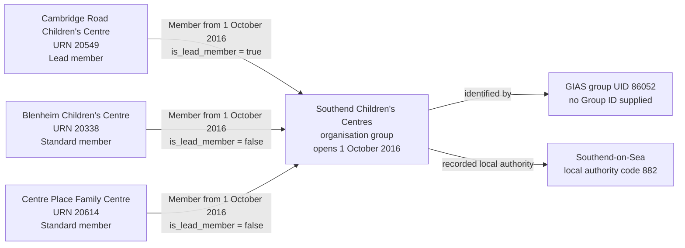

# T5 — Southend Children's Centres

T5 tests that Southend Children's Centres is recorded as one organisation group with nine members, with Cambridge Road Children's Centre identified as its sole lead member.

## Children's-centre group

T5 covers Southend Children's Centres, group UID 86052, and its nine member establishments.

| Field | Local source value |
| --- | --- |
| Group UID | 86052 |
| Group name | Southend Children's Centres |
| Group type | Children's Centres Group (source code 08) |
| Group ID | Null |
| Local authority | Southend-on-Sea (code 882) |
| Group open date | 2016-10-01 |
| Group closed date | Null |
| Companies House number | Null |
| UKPRN | Null |
| Members | Nine active, open children's centres |
| Lead centre | Cambridge Road Children's Centre, URN 20549 |

Unlike the T4 federation, this group has its own recorded local authority. Code 882 comes directly from `EstablishmentGroup.localAuthority_code`; it is not inferred from the members. Every member also has establishment local-authority code 882.

## Local source evidence

The local source returns exactly nine links for group 86052, all with `archived = 0`. Every member is an open children's centre, source establishment type 47 and status 1. The query for other group links held by these nine establishments returned no additional records.

| URN | Establishment | Source GroupLink ID | Establishment open date | Membership effective date | `ccLinkType` | Target `is_lead_member` |
| --- | --- | --- | --- | --- | --- | --- |
| 20338 | Blenheim Children's Centre | 25390 | 2008-02-07 | 2016-10-01 | STANDARD | False |
| 20549 | Cambridge Road Children's Centre | 25391 | 2006-03-14 | 2016-10-01 | LEAD | True |
| 20614 | Centre Place Family Centre | 25392 | 2008-03-03 | 2016-10-01 | STANDARD | False |
| 21363 | Hamstel Children and Family Centre | 25395 | 2009-12-14 | 2016-10-01 | STANDARD | False |
| 22422 | Prince Avenue Children and Family Centre | 25396 | 2009-12-14 | 2016-10-01 | STANDARD | False |
| 22459 | Friars Children's Centre | 25394 | 2008-01-16 | 2016-10-01 | STANDARD | False |
| 22975 | Summercourt Children's Centre | 25397 | 2008-01-16 | 2016-10-01 | STANDARD | False |
| 23004 | Eastwood Children's Centre | 25393 | 2008-02-07 | 2016-10-01 | STANDARD | False |
| 23122 | Temple Sutton Children's Centre | 25398 | 2006-09-28 | 2016-10-01 | STANDARD | False |

All establishment close dates are null. The membership links do not provide end dates. Each membership joined date comes from its own effective date; those dates happen to match the group's open date. The earlier establishment open dates remain separate lifecycle facts and are not replaced with the group or membership dates.

The lead flag comes from the explicit `ccLinkType` value: `LEAD` maps to true and `STANDARD` maps to false. An absent or unrecognised value must not silently become false. This case demonstrates one observed lead centre; it does not supply a history of changes to that flag.

## Relationship graph

The graph shows the lead and two standard members for readability. Six further standard members are listed in the evidence table. The group has nine members in total, not three. The local authority relationship shown is recorded on the group; each establishment also has its own local-authority information.

## Target interpretation

| Target table | Expected records for T5 |
| --- | --- |
| `establishment` | Nine separate children's-centre records, retaining their five-digit URNs and independently recorded establishment open dates. |
| `organisation_group` | One children's-centre group named Southend Children's Centres, `open_date = 2016-10-01`, unknown `close_date`, and `local_authority_id` pointing to Southend-on-Sea. |
| `organisation_group_member` | Nine memberships, each with `joined_date = 2016-10-01` and unknown `left_date`. Cambridge Road has `is_lead_member = true`; the other eight have false. |
| `group_identifier` | One GIAS Group UID value `86052`, attached to the organisation group. No Group ID is invented. |
| `legal_entity`, `organisation_identifier`, `establishment_party_role`, `academy_trust_classification`, `establishment_responsibility` | No records created merely to represent this group, its lead designation or its memberships. |
| Migration evidence | Retain the nine source-link IDs, active-link state and `ccLinkType` values, with each membership linked to its own source record beneath the shared rebuild run. |

The group is not a legal entity. The lead designation is an attribute of Cambridge Road's membership, not a separate legal entity, party role or operating responsibility. The group's local-authority association does not by itself create an establishment responsibility held by that authority.

The active links establish the observed current membership. Unknown leaving dates do not prove indefinite membership. Lead-centre history is outside this slice; future updates change the current lead designation without fabricating an earlier lead period.

All nine establishments are required to exercise this whole-group case. Importing only Cambridge Road would demonstrate a lead flag, but would not validate the full membership set or establish that it is the only lead among the group's members.

## Evidence limits

The reviewed group and membership fields have no placeholder dates, duplicate member links, multiple lead flags or local-authority disagreement. This is a bounded assessment of those fields, not a claim that every source field is accurate. Core establishment approval snapshots retain the source values, including obfuscated contact and address data. Missing school-capacity measures and statutory school-age ranges remain absent rather than being invented for children's centres.

## Expected checks

- All nine establishments retain their original five-digit URNs; no padding or replacement identifiers are introduced.
- UID 86052 identifies one children's-centre organisation group, not a party role.
- The group's local authority resolves from source code 882 to Southend-on-Sea.
- All nine members belong to that local authority and match the selected source membership set exactly.
- Each joined date comes from its own GroupLink effective date, with no invented leaving date.
- Exactly Cambridge Road, URN 20549, has `is_lead_member = true`; the other eight explicitly have false.
- Missing or unrecognised lead codes stop for assessment rather than defaulting to a standard member.
- No Companies House number, organisation UKPRN, Group ID or group legal entity is invented.
- Membership and lead designation create no establishment responsibility.
- Each member's evidence points to the correct source link and retains the original `ccLinkType` beneath the shared rebuild run.
