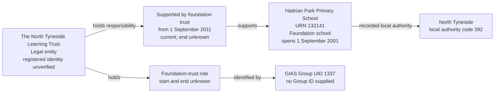

# T6 — Hadrian Park Primary School and The North Tyneside Learning Trust

T6 tests that The North Tyneside Learning Trust is recorded as a legal entity with a foundation-trust role and a support responsibility for Hadrian Park Primary School, rather than as its academy operator.

## Foundation-trust support

T6 covers one foundation trust supporting one establishment: Hadrian Park Primary School, URN 132141, and The North Tyneside Learning Trust, group UID 1337.

This is the smallest slice that exercises the trust's legal entity, foundation-trust role, role identifier and establishment-specific support responsibility. It is not a whole-trust migration.

| Field | Local source value |
| --- | --- |
| Establishment URN | 132141 |
| Establishment name | Hadrian Park Primary School |
| Establishment type | Foundation school (source code 05) |
| Establishment status | Open (source code 1) |
| Establishment open date | 2001-09-01 |
| Establishment close date | Null |
| Establishment local authority | North Tyneside (code 392) |
| Trust name | The North Tyneside Learning Trust |
| Group UID | 1337 |
| Group type | Trust (source code 02), mapped to Foundation trust |
| Group ID | Null |
| Companies House number | Null |
| UKPRN | Null |
| Group open date | 2010-09-03 |
| Group closed date | Null |
| Group local-authority code | 999 (not recorded) |
| Source GroupLink ID | 1029 |
| Link effective date | 2011-09-01 |
| Link archived | 0 |
| Link version | 0 |
| Link `linkType` / `ccLinkType` | Both null |

The establishment has exactly one group link in the returned source records: link 1029 to UID 1337. The source group type supplies the foundation-trust interpretation; the null `linkType` is not treated as an unknown academy-trust classification.

## Relationship graph



The foundation trust is represented as a legal entity with a role, not as an `organisation_group`. Its support relationship is not federation membership and does not assert that it operates the school as an academy trust.

## Target interpretation

| Target table | Expected records for T6 |
| --- | --- |
| `establishment` | Hadrian Park Primary School, URN 132141, retaining its establishment type and lifecycle dates. |
| `legal_entity` | One separate record named The North Tyneside Learning Trust. Registered legal identity, legal-entity type, charity status, incorporation and dissolution dates remain unverified; do not invent them. |
| `establishment_party_role` | One Foundation trust role held by that legal entity. Start and end dates remain unknown. |
| `group_identifier` | One current GIAS Group UID value `1337`, attached to the foundation-trust role, not directly to the legal entity or an organisation group. No Group ID is invented. |
| `establishment_responsibility` | One current Supported by foundation trust responsibility for URN 132141, starting on 2011-09-01 with unknown end date. `academy_trust_type_id` and `person_id` are null. |
| `organisation_identifier` | No company number or UKPRN is supplied by this source record. |
| `academy_trust_classification`, `organisation_group`, `organisation_group_member` | No records created merely to represent this foundation trust or its school-support relationship. |
| Migration evidence | Preserve source UID 1337, GroupLink 1029, URN 132141, the active-link assertion and the separate source group open date. Record provisional identity allocation and link the role and responsibility to their evidence beneath the rebuild run. The role's `first_observed_date` is the import snapshot date, not the source group open date. |

The three source dates describe different facts: the establishment opened on 1 September 2001; the source group record opened on 3 September 2010; the school's support link became effective on 1 September 2011. The source group open date is not evidence of company incorporation or the actual start of the role. It must not replace either the establishment open date or responsibility start date. A snapshot observation date, where retained, is also distinct from those business dates.

The current assertion comes from the non-archived link to an open source trust for an open establishment. Unknown end dates do not prove indefinite duration. The school's local authority is recorded independently; source group authority code 999 must not be replaced by 392 merely because the selected school is in North Tyneside.

## Evidence limits

UID 1337 has 40 source links covering 39 distinct URNs: 35 active links and five archived links. Of the active links, 32 point to open establishments, two point to closed establishments and one points to an establishment absent from the local copy. These are observed source counts, not a claim that all 35 active links are valid current responsibilities. None of those other links is included in this slice.

The source also contains UID 1596 with the same trust name, no company number or UKPRN, and matching open and closed dates of 2012-10-01. A matching name is not proof of the same legal entity. Do not merge UID 1596 into UID 1337 without separate identity evidence.

The selected link has a recorded, non-placeholder effective date, an open establishment and an open trust, with no duplicate selected link. This assesses the relationship fields only. It does not verify every establishment measure or contact field, or establish the trust's registered legal identity. Missing company and UKPRN values are preserved, not treated as permission for a name-only merge.

## Target query

```sql
SELECT e.urn, e.name AS establishment,
       le.legal_entity_id, le.name AS foundation_trust,
       role_type.name AS party_role,
       gi.value AS gias_group_uid,
       role.start_date AS role_start_date,
       role.end_date AS role_end_date,
       rt.name AS responsibility,
       r.start_date AS responsibility_start_date,
       r.end_date AS responsibility_end_date,
       r.is_current
FROM establishment.establishment e
JOIN establishment.establishment_responsibility r USING (establishment_id)
JOIN establishment.establishment_responsibility_type rt USING (responsibility_type_id)
JOIN establishment.legal_entity le USING (legal_entity_id)
JOIN establishment.establishment_party_role role ON role.legal_entity_id=le.legal_entity_id
JOIN establishment.establishment_party_role_type role_type USING (establishment_party_role_type_id)
JOIN establishment.group_identifier gi USING (establishment_party_role_id)
JOIN establishment.group_identifier_type git USING (group_identifier_type_id)
JOIN establishment.group_identifier_issuer issuer USING (group_identifier_issuer_id)
WHERE e.urn=132141
  AND rt.name='Supported by foundation trust'
  AND role_type.name='Foundation trust'
  AND git.name='Group UID' AND issuer.name='GIAS'
  AND gi.value='1337' AND gi.is_current
ORDER BY r.start_date;
```

## Expected checks

- One establishment, one provisional legal entity, one Foundation trust role and one support responsibility are represented in this slice.
- UID 1337 belongs to the foundation-trust role and resolves to the responsibility's legal entity.
- The responsibility begins on 2011-09-01, independently of the school and source group open dates.
- No academy-trust classification, organisation-group membership or operating responsibility is created from this link.
- No Group ID, company number, UKPRN, registered legal type or incorporation date is invented.
- Source record 1596 is not merged on name alone; the other 39 link records are not implicitly selected.
- Evidence retains GroupLink 1029, the source identity decision and the shared rebuild-run association.
