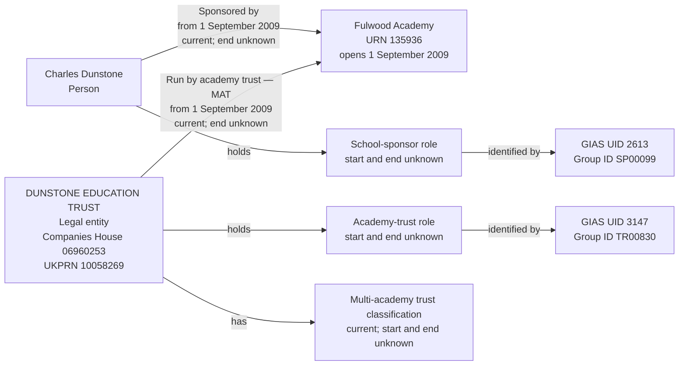

# T7 — Fulwood Academy, Charles Dunstone and Dunstone Education Trust

T7 tests that Charles Dunstone is recorded as a person sponsoring Fulwood Academy, separately from Dunstone Education Trust, the legal entity operating it.

## Person sponsor and academy-trust operator

T7 covers Fulwood Academy, URN 135936. Charles Dunstone is represented as its person sponsor, separately from DUNSTONE EDUCATION TRUST, the legal entity operating the academy.

The case exercises two different party kinds holding two different responsibilities for the same establishment. Sponsorship does not mean operation, and the sponsor's personal name must not become a legal-entity record merely because BAU stores sponsors in `EstablishmentGroup`.

| Establishment field | Local source value |
| --- | --- |
| URN | 135936 |
| Name | Fulwood Academy |
| UKPRN | 10027711 |
| Establishment type | Academy sponsor led (source code 28) |
| Status | Open (source code 1) |
| Open date | 2009-09-01 |
| Close date | Null |
| Local authority | Lancashire (code 888) |

## Local source evidence

| Field | Sponsor | Operating trust |
| --- | --- | --- |
| Source name | Charles Dunstone | DUNSTONE EDUCATION TRUST |
| Group UID | 2613 | 3147 |
| Group ID | SP00099 | TR00830 |
| Source group type | School sponsor (05) | Multi-academy trust (06) |
| Companies House number | Null | 06960253 |
| UKPRN | Null | 10058269 |
| Group open date | 1900-01-01 — placeholder, not a business date | 2009-07-13 |
| Group closed date | Null | Null |
| Group local-authority code | 999 (not recorded) | 999 (not recorded) |
| Source GroupLink ID | 3648 | 5539 |
| Linked establishment URN | 135936 | 135936 |
| Link effective date | 2009-09-01 | 2009-09-01 |
| Link archived | 0 | 0 |
| Link version | 0 | 0 |
| Link `linkType` / `ccLinkType` | Both null | Both null |

The source returns exactly these two group links for Fulwood. No `GroupRelationsLink` records involving either UID were returned. Different group types establish the different source assertions; the links' matching effective dates do not establish a shared party identity.

The academy UKPRN 10027711 belongs to the establishment. The trust UKPRN 10058269 belongs to the legal entity. Neither value belongs to the person sponsor.

## Relationship graph



The role identifiers remain separate: sponsor UID 2613 and SP00099 belong to the person's school-sponsor role; trust UID 3147 and TR00830 belong to the legal entity's academy-trust role. Company and provider identifiers belong to the legal entity, not its role or the sponsor.

## Target interpretation

| Target table | Expected records for T7 |
| --- | --- |
| `establishment` | Fulwood Academy, URN 135936, with its establishment UKPRN and independent lifecycle. |
| `person` | One person endpoint for Charles Dunstone. The current physical table holds only `person_id`; retain the source name and person-mapping decision in migration evidence rather than inventing a person-name column in this slice. |
| `legal_entity` | One operating trust, DUNSTONE EDUCATION TRUST. The current academy-trust mapping uses source group open date 2009-07-13 as incorporation date and the supplied company identifier to assign the existing academy-trust legal type. This source-derived mapping is not an independent Companies House verification. No legal entity is created for Charles Dunstone. |
| `organisation_identifier` | Companies House number `06960253` and UKPRN `10058269`, both owned by the operating trust. |
| `establishment_party_role` | One School sponsor role with `person_id` set and `legal_entity_id` null; one Academy trust role with `legal_entity_id` set and `person_id` null. Both role periods have unknown start and end dates. |
| `group_identifier` | Four current GIAS identifiers: UID `2613` and Group ID `SP00099` on the sponsor role; UID `3147` and Group ID `TR00830` on the academy-trust role. |
| `academy_trust_classification` | One current Multi-academy trust classification for the operating legal entity, with unknown start and end dates. None for the person. |
| `establishment_responsibility` | One current Sponsored by responsibility held by the person and one current Run by academy trust responsibility held by the trust, both starting on 2009-09-01 with unknown ends. Trust type is Multi-academy trust on the operating responsibility and null on sponsorship. |
| `organisation_group`, `organisation_group_member` | No records created from these sponsor and trust links. |
| Migration evidence | Separate source records for links 3648 and 5539, retaining the source party kinds, active assertions and identity decisions beneath the shared rebuild run. Preserve the rejected raw sponsor open date with its placeholder assessment. Where role observation dates are recorded, use the snapshot date rather than either source open date. |

Every role and responsibility has exactly one holder: a person or a legal entity, never both. The trust's incorporation mapping, academy-trust role, MAT classification and operating responsibility remain independently dated facts. The school opening and responsibility dates happen to match; this does not justify populating the role or classification starts.

## Evidence limits

Sponsor group open date 1900-01-01 is a source-data-quality concern. It must not populate a role start, responsibility start, incorporation date or observation date. The valid link effective date 2009-09-01 remains the sponsorship start; it does not repair or explain the placeholder.

The person interpretation is supported by Fulwood's [Welcome from the Sponsor](https://www.fulwoodacademy.co.uk/page/?pid=53&title=Welcome+from+the+Sponsor), which identifies Sir Charles Dunstone as its sponsor and states that he funds the academy personally. This supports the explicit T7 person mapping; the source itself supplies a name and sponsor type, not a verified person identifier or an explicit person/organisation discriminator. A Companies House number is not applicable to this person, rather than a missing required identifier. Absence of a company number is not a general rule for classifying sponsors as people: other sponsors can be organisations without such an identifier. Do not automatically apply this mapping to similarly named records or merge this person with the academy trust.

This is a bounded assessment of the two source links. It is not a claim that every establishment field or the sponsor's wider identity has been independently verified. Unknown ends do not mean indefinite responsibility. No history of person-sponsor recognition or MAT classification is supplied by these links.

## Target query

```sql
SELECT e.urn, e.name AS establishment,
       rt.name AS responsibility,
       CASE WHEN r.person_id IS NOT NULL THEN 'Person' ELSE 'Legal entity' END AS holder_kind,
       r.person_id, r.legal_entity_id,
       le.name AS legal_entity,
       role_type.name AS party_role,
       ids.gias_group_uid, ids.gias_group_id,
       trust_type.name AS responsibility_trust_type,
       r.start_date, r.end_date, r.is_current
FROM establishment.establishment e
JOIN establishment.establishment_responsibility r USING (establishment_id)
JOIN establishment.establishment_responsibility_type rt USING (responsibility_type_id)
LEFT JOIN establishment.legal_entity le USING (legal_entity_id)
JOIN establishment.establishment_party_role role
  ON (r.person_id IS NOT NULL AND role.person_id=r.person_id)
  OR (r.legal_entity_id IS NOT NULL AND role.legal_entity_id=r.legal_entity_id)
JOIN establishment.establishment_party_role_type role_type USING (establishment_party_role_type_id)
LEFT JOIN establishment.academy_trust_type trust_type
  ON trust_type.academy_trust_type_id=r.academy_trust_type_id
LEFT JOIN LATERAL (
    SELECT max(i.value) FILTER (WHERE t.name='Group UID') AS gias_group_uid,
           max(i.value) FILTER (WHERE t.name='Group ID') AS gias_group_id
    FROM establishment.group_identifier i
    JOIN establishment.group_identifier_type t USING (group_identifier_type_id)
    JOIN establishment.group_identifier_issuer issuer USING (group_identifier_issuer_id)
    WHERE i.establishment_party_role_id=role.establishment_party_role_id
      AND issuer.name='GIAS' AND i.is_current
) ids ON true
WHERE e.urn=135936
  AND ((rt.name='Sponsored by' AND role_type.name='School sponsor')
    OR (rt.name='Run by academy trust' AND role_type.name='Academy trust'))
ORDER BY rt.name;
```

The expected result is two rows: a person sponsor identified through role UID 2613, and a separate legal-entity operator identified through role UID 3147. The person row has no live name column; its source name is retained in migration evidence.

## Expected checks

- One establishment has two responsibilities with distinct holders and correct party kinds.
- Charles Dunstone is not created as a legal entity or merged with Dunstone Education Trust.
- The sponsor role and responsibility use the same person endpoint; the operator role, classification, identifiers and responsibility use the same legal-entity endpoint.
- All four GIAS identifiers are attached to the appropriate role, with company number and trust UKPRN owned only by the legal entity.
- Both responsibilities start on 2009-09-01 and are current, with unknown ends.
- Sponsor source date 1900-01-01 is retained only as rejected source evidence, never as a target business date.
- Neither role start nor MAT classification start is inferred from the school or trust opening date.
- Source links 3648 and 5539 each retain their own evidence; person classification is an explicit mapping, not a name-only identity merge.
