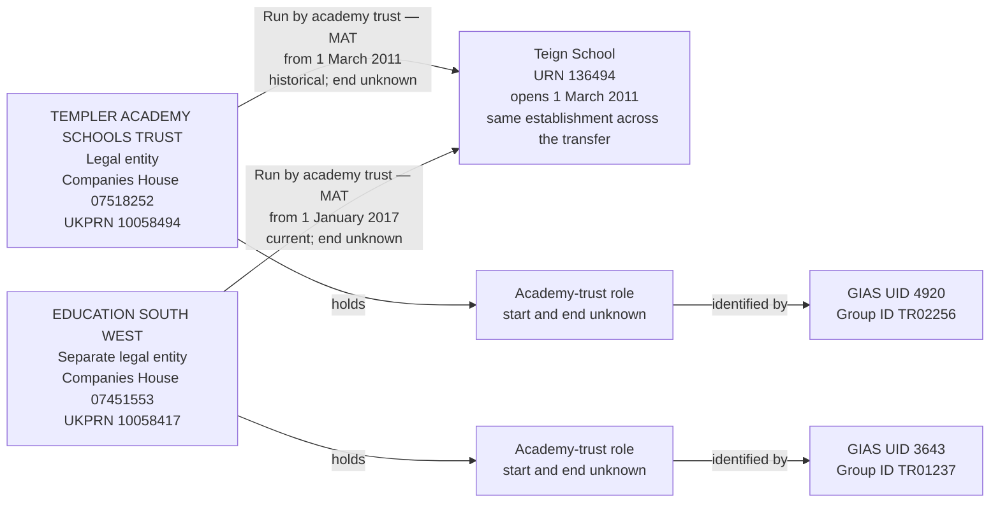

# T8 — Teign School changes operating trust

T8 tests that Teign School retains its establishment identity as its operator changes from Templer Academy Schools Trust to Education South West, with separate historical and current operating responsibilities.

## Successive legal operators

T8 covers Teign School, URN 136494, with a historical operating responsibility held by TEMPLER ACADEMY SCHOOLS TRUST and a current responsibility held by EDUCATION SOUTH WEST. The establishment keeps its identity and URN.

Both source trusts are classified as multi-academy trusts. Different Companies House numbers and UKPRNs identify two separate legal entities: this is a change of operator, not a SAT-to-MAT classification change within one company.

| Establishment field | Local source value |
| --- | --- |
| URN | 136494 |
| Name | Teign School |
| UKPRN | 10033036 |
| Establishment type | Academy converter (source code 34) |
| Status | Open (source code 1) |
| Open date | 2011-03-01 |
| Close date | Null |
| Local authority | Devon (code 878) |

## Local source evidence

| Field | Former operator | Current operator |
| --- | --- | --- |
| Source name | TEMPLER ACADEMY SCHOOLS TRUST | EDUCATION SOUTH WEST |
| Group UID | 4920 | 3643 |
| Group ID | TR02256 | TR01237 |
| Group type | Multi-academy trust (06) | Multi-academy trust (06) |
| Companies House number | 07518252 | 07451553 |
| UKPRN | 10058494 | 10058417 |
| Group open date | 2011-02-04 | 2010-11-25 |
| Group closed date | Null | Null |
| Group local-authority code | 999 (not recorded) | 999 (not recorded) |
| Source GroupLink ID | 7097 | 26320 |
| Linked establishment URN | 136494 | 136494 |
| Link effective date | 2011-03-01 | 2017-01-01 |
| Link archived | 1 | 0 |
| Link version | 1 | 0 |
| Link `linkType` / `ccLinkType` | Both null | Both null |

There are exactly two academy-trust links for this establishment: one archived and one current. A third link, GroupLink 26321, identifies sponsor UID 3642, Academies South West, from 2017-01-01. Sponsorship is separate from the operating-trust transfer and is outside this slice. No `GroupRelationsLink` records involving either selected trust UID were returned.

The company and provider identifiers establish separate source parties. A matching establishment URN preserves the establishment's identity across the transfer. The school's own UKPRN 10033036 must not be assigned to either trust.

## Relationship graph



Both trust records remain open and typed MAT in the source. An archived relationship to Teign does not, by itself, mean that Templer ceased being an academy trust or a MAT.

## Dates and current state

```text
                         2011-03-01            2017-01-01
                              |                    |
Teign establishment           +--------------------+------> Open
Templer responsibility        +------- end unknown          Historical
Education South West                               +------> Current
```

The display does not assert that Templer's responsibility ended on 2017-01-01. That is the new operator's recorded start date, not an independently recorded end date for the old operator. Preserve the historical assertion using `is_current = false`, leaving its end null.

The group open dates, school open date and relationship effective dates describe separate facts. The existing academy-trust mapping uses group open dates as source-derived incorporation dates; it is not independent company-register verification. Do not use those dates to populate academy-trust role or MAT-classification starts.

## Target interpretation

| Target table | Expected records for T8 |
| --- | --- |
| `establishment` | One Teign School record, URN 136494, retaining its own UKPRN and lifecycle. No replacement establishment is created for the transfer. |
| `legal_entity` | Two separate companies with their source names and independently owned company numbers and UKPRNs. The existing academy-trust mapping supplies source-derived incorporation dates and the academy-trust legal type; charity status is not invented. |
| `organisation_identifier` | Companies House `07518252` and UKPRN `10058494` belong to Templer; Companies House `07451553` and UKPRN `10058417` belong to Education South West. |
| `establishment_party_role` | One Academy trust role for each legal entity. Both have unknown start and end dates; archiving one school's link does not close the former operator's role. |
| `group_identifier` | UID `4920` and Group ID `TR02256` belong to Templer's role; UID `3643` and Group ID `TR01237` belong to Education South West's role. Both source groups are open, so the archived school link alone must not retire those identifiers. |
| `academy_trust_classification` | One source-current Multi-academy trust classification per legal entity, independently of each company's responsibility for Teign. Starts and ends remain unknown. The archived Teign link alone must not make Templer's classification historical. |
| `establishment_responsibility` | Two Run by academy trust responsibilities, both typed MAT: Templer from 2011-03-01, unknown end, `is_current = false`; Education South West from 2017-01-01, unknown end, `is_current = true`. |
| `organisation_group`, `organisation_group_member` | No records created for either operating trust or the transfer. |
| Migration evidence | Separate source records retaining GroupLinks 7097 and 26320, their source UIDs, effective dates and independent archived states, alongside identity decisions beneath the rebuild run. Preserve the distinction between a source-open trust and an archived school relationship. |

There are two legal-entity classification periods and two establishment-specific responsibility periods. They are separate assertions, even though both entities are MATs. The model does not collapse them into one operator or derive the trust-wide classification's current state from the school's relationship state.

## Evidence limits

The selected links have non-placeholder start dates, distinct company identities and exactly one current operating-trust assertion. Neither link supplies a responsibility end date. The source group records have no closed dates; this describes their source state, not a fresh verification of Companies House status.

The archived flag establishes that Templer's relationship is historical in the source, not the date on which it ended. The source does not independently prove gap-free or non-overlapping historical operation. Do not infer an old responsibility end, trust closure, role closure or classification end from Education South West's link start.

The reviewed fields concern operator identity and relationship state. They do not certify every contact, capacity or geographical field. Sponsor UID 3642 is not resolved or merged into either operator by this case.

## Target query

```sql
SELECT e.urn, e.name AS establishment,
       le.legal_entity_id, le.name AS operating_trust,
       ids.gias_group_uid, ids.gias_group_id,
       trust_type.name AS responsibility_trust_type,
       r.start_date, r.end_date, r.is_current AS responsibility_current,
       role.start_date AS role_start, role.end_date AS role_end,
       classification_type.name AS trust_classification,
       c.start_date AS classification_start, c.end_date AS classification_end,
       c.is_current AS classification_current
FROM establishment.establishment e
JOIN establishment.establishment_responsibility r USING (establishment_id)
JOIN establishment.establishment_responsibility_type rt USING (responsibility_type_id)
JOIN establishment.legal_entity le USING (legal_entity_id)
JOIN establishment.establishment_party_role role ON role.legal_entity_id=le.legal_entity_id
JOIN establishment.establishment_party_role_type role_type USING (establishment_party_role_type_id)
LEFT JOIN establishment.academy_trust_type trust_type
  ON trust_type.academy_trust_type_id=r.academy_trust_type_id
LEFT JOIN establishment.academy_trust_classification c
  ON c.legal_entity_id=le.legal_entity_id AND c.is_current
LEFT JOIN establishment.academy_trust_type classification_type
  ON classification_type.academy_trust_type_id=c.academy_trust_type_id
LEFT JOIN LATERAL (
    SELECT max(i.value) FILTER (WHERE t.name='Group UID') AS gias_group_uid,
           max(i.value) FILTER (WHERE t.name='Group ID') AS gias_group_id
    FROM establishment.group_identifier i
    JOIN establishment.group_identifier_type t USING (group_identifier_type_id)
    JOIN establishment.group_identifier_issuer issuer USING (group_identifier_issuer_id)
    WHERE i.establishment_party_role_id=role.establishment_party_role_id
      AND issuer.name='GIAS' AND i.is_current
) ids ON true
WHERE e.urn=136494 AND rt.name='Run by academy trust' AND role_type.name='Academy trust'
ORDER BY r.start_date;
```

The expected result is two operator rows for the same URN. Only Education South West's responsibility is current; both source-open trusts have their own source-current MAT classifications and identifiers.

## Expected checks

- One establishment retains URN 136494 across both responsibilities.
- Two companies are represented separately, with correct identifier ownership and no identity consolidation.
- Both role UIDs and Group IDs remain visible on their respective academy-trust roles.
- The former responsibility is historical from 2011-03-01 with unknown end; the current responsibility starts on 2017-01-01 with unknown end.
- Exactly one current academy-trust operating responsibility exists for Teign.
- Both source-open trusts retain their own MAT assertions; a school-link archive does not close a role or retire trust identifiers.
- No successor start date is copied into a predecessor's unknown end date.
- Source links 7097 and 26320 retain their separate evidence and archived states.
- Sponsor link 26321 is not silently treated as an operating relationship or merged into either company.
