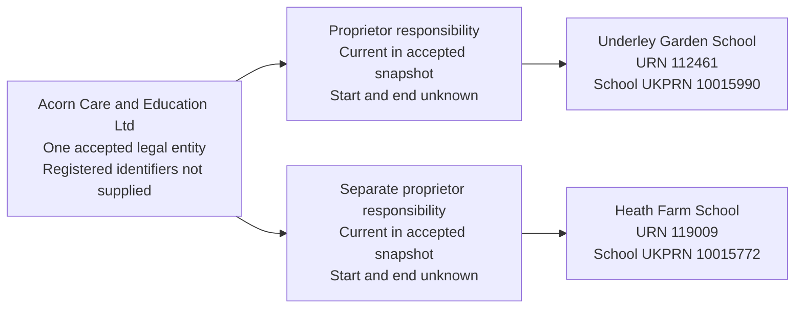

# T9 — Acorn Care and Education Ltd is proprietor of two schools

T9 tests that Acorn Care and Education Ltd is recorded as one legal entity responsible for managing Underley Garden School and Heath Farm School through separate proprietor responsibilities.

## One proprietor, multiple establishments

T9 covers one accepted proprietor identity holding current responsibilities for two establishments: Underley Garden School, URN 112461, and Heath Farm School, URN 119009.

This is the smallest slice that tests reuse of a proprietor legal entity across schools. It does not migrate Acorn's whole portfolio.


The proprietor identity is explicitly accepted for this controlled fixture: both selected proprietor assertions resolve to one shared legal entity. Repeated names alone must not become an automatic identity-resolution rule for wider migration.

## Establishment evidence

| Field | T9a | T9b |
| --- | --- | --- |
| URN | 112461 | 119009 |
| Establishment name | Underley Garden School | Heath Farm School |
| Local establishment type | Other independent special school (10) | Other independent special school (10) |
| Local status | Open (1) | Open (1) |
| Local open date | 1990-03-28 | 1988-12-12 |
| Local close date | Null | Null |
| Establishment UKPRN | 10015990 | 10015772 |
| Local-authority code | 943 | 886 |
| Exact extract `PropsName` | Acorn Care and Education Ltd | Acorn Care and Education Ltd |
| Local `IndependentSchools.proprietorType_code` | 01 — Individual Proprietor | 01 — Individual Proprietor |
| Additional `EstablishmentProprietors` rows | 1 | 1 |

The establishment fields above were checked in the local source database. The exact `PropsName` assertions come from the 16 June 2026 establishment extract, `edubasealldata20260616.csv`, not from a local `PropsName` column. The selected assertions are reproduced above and exercise Acorn's multiple proprietor responsibilities.

## Controlled proprietor evidence

The local proprietor data is obfuscated. Its Individual Proprietor classification cannot be used as evidence that Acorn is a person, nor can the local name fields safely establish a shared Acorn identity. The additional proprietor rows are not assumed to identify Acorn or to be duplicates of the principal proprietor.

The controlled fixture supplies these accepted assertions separately from the unchanged local source records:

| Assertion | Controlled fixture value |
| --- | --- |
| Party | One legal entity named Acorn Care and Education Ltd |
| Identity decision | Both selected extract name assertions resolve to this one accepted party |
| Responsibility | Proprietor of each selected establishment |
| Current state | Both responsibilities are current in the accepted extract snapshot |
| Responsibility start and end | Unknown; both null |
| Companies House number / organisation UKPRN | Not supplied; both absent |
| Legal form, charity status and incorporation/dissolution dates | Unverified; no values inferred from the company-like name |
| Evidence observation | 2026-06-16 for the accepted extract assertions; import date recorded separately |

This is a documented fixture overlay, not a claim that the local source supplies the accepted proprietor party. Preserve the local source classification and the controlled identity decision separately in migration evidence. The accepted proprietor identity is not treated as a DQ case; a controlled fixture is required because of local obfuscation.

No proprietor contact names, addresses, telephone numbers or email addresses are required for this case.

## Relationship graph



The school UKPRNs belong to the establishments, not to Acorn. This case creates no GIAS group identity for the proprietor.

## Target interpretation

| Target table | Expected records for T9 |
| --- | --- |
| `establishment` | Two separate establishment records with URNs 112461 and 119009, each retaining its own identity, classification and lifecycle. |
| Core establishment substructures | Load mapped local geography, contact, main site/address, provision and measures through the shared establishment loader. Missing source facts remain absent; this case does not certify every core field. |
| `legal_entity` | One accepted proprietor party named Acorn Care and Education Ltd, reused by both responsibilities. Unverified legal form, charity status and company dates remain null. |
| `establishment_responsibility` | Two current Proprietor responsibilities sharing the same `legal_entity_id`, one per school. Both have null start/end dates, `person_id` and `academy_trust_type_id`. |
| `organisation_identifier` | None supplied for Acorn. Do not copy either school's UKPRN to its proprietor. |
| `establishment_party_role`, `group_identifier` | No records created merely for proprietorship: the logical model has no corresponding proprietor party role or GIAS group record. |
| `person`, `academy_trust_classification`, `organisation_group`, `organisation_group_member` | No records created by the selected proprietor assertions. |
| Migration evidence | Retain each extract URN/name assertion, extract observation date, source provenance and accepted shared-party decision. Clearly distinguish controlled assertions from the local obfuscated proprietor records and retain the import-run context. |

Proprietorship is recorded directly as a responsibility, not as a group membership or a new proprietor-role type.

## Dates and current state

```text
1988-12-12                 Heath Farm School opens
1990-03-28                 Underley Garden School opens
                                 |
                                 | Acorn responsibility starts unknown
                                 |
2026-06-16                 Both Acorn proprietor assertions observed
                                 |
                                 +--- import date recorded separately
```

The schools' opening dates do not establish when Acorn became their proprietor. Observation of a current relationship does not establish its start date. Neither the extract date nor the import date is copied into `start_date`.

## Evidence limits

The two selected assertions exercise shared-party reuse, not every proprietor in the local numbered rows or every school in Acorn's portfolio. No Companies House match has been established by this case. The closed sponsor record Acorn Care, UID 2068 / SP00007, is not merged into the proprietor without a separate identity decision.

Local source classification, accepted extract assertions and target identity decisions remain distinguishable. The controlled fixture must not silently overwrite raw source evidence or be presented as a directly queried local Acorn relationship.

## Target query

```sql
SELECT e.urn, e.name AS establishment,
       le.legal_entity_id, le.name AS proprietor,
       legal_type.name AS verified_legal_form,
       rt.name AS responsibility,
       r.start_date, r.end_date, r.is_current,
       ev.first_observed_date, ss.source_system,
       ss.snapshot_date, ev.notes
FROM establishment.establishment e
JOIN establishment.establishment_responsibility r USING (establishment_id)
JOIN establishment.establishment_responsibility_type rt USING (responsibility_type_id)
JOIN establishment.legal_entity le USING (legal_entity_id)
LEFT JOIN establishment.legal_entity_type legal_type USING (legal_entity_type_id)
JOIN migration.establishment_responsibility_evidence ev USING (establishment_responsibility_id)
JOIN migration.source_record sr USING (source_record_id)
JOIN migration.source_snapshot ss USING (source_snapshot_id)
WHERE e.urn IN (112461,119009) AND rt.name='Proprietor'
ORDER BY e.urn, ss.source_system;
```

The four evidence rows describe two responsibilities: each has an accepted extract assertion and a separate local-context observation. The same Acorn `legal_entity_id` appears for both schools; verified legal form and responsibility dates remain null. Core test-data values are preserved from the local copy, not certified as live-service facts.

## Expected checks

- Both establishments exist separately with the correct URNs and school UKPRNs.
- Exactly one selected Acorn proprietor legal entity is reused by both responsibilities.
- Each school has its own current Proprietor responsibility to that party.
- Responsibility start/end dates remain null; the schools' opening dates are not reused.
- Both responsibility rows have null `person_id` and `academy_trust_type_id`.
- No proprietor party role, group identifier, academy-trust classification or organisation-group membership is fabricated.
- The fixture does not automatically import the obfuscated additional proprietor rows as Acorn.
- Both accepted name assertions and their observation date remain traceable to the extract and controlled identity decision.
- Re-running the eventual import does not create duplicate Acorn parties or duplicate responsibilities.

