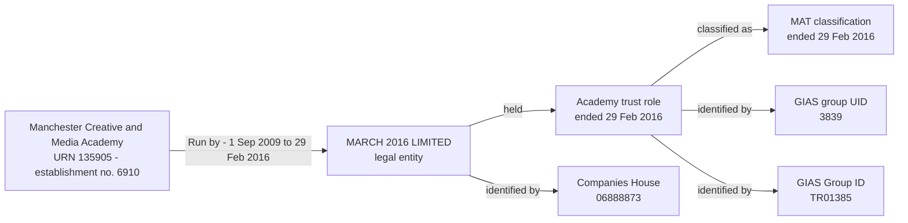

# URN 135905: Manchester Creative and Media Academy

This case shows the establishment-group records currently held for URN
135905 in the local establishment_local database.

The establishment number is 6910; it is not the URN.

## Establishment

| Field | Value |
| --- | --- |
| Establishment ID | 0cd86143-2f88-4b3e-8278-fe9aaecdafad |
| URN | 135905 |
| Establishment number | 6910 |
| Name | Manchester Creative and Media Academy |
| Establishment type ID | 4 |
| Education phase ID | 5 |
| Local authority code | 352 |

## Related group-model records

| Record | Value |
| --- | --- |
| Legal entity | MARCH 2016 LIMITED |
| Companies House number | 06888873 |
| Establishment party role | Academy trust |
| Role period | Start unknown; ended 2016-02-29 |
| Academy-trust classification | Multi-academy trust |
| Classification period | Start unknown; ended 2016-02-29 |
| Responsibility | Run by academy trust |
| Responsibility period | 2009-09-01 to 2016-02-29 |
| Responsibility end-date basis | Inferred from establishment closure |
| GIAS group UID | 3839 |
| GIAS Group ID | TR01385 |
| Organisation-group membership | None recorded |

## Relationship graph



## Query

Run this query against establishment_local to return the establishment and
all related records represented in the establishment-groups logical model.
The result is returned as one JSON document per record type.

```sql
WITH target AS (
    SELECT *
    FROM establishment.establishment
    WHERE urn = 135905
),
responsibilities AS (
    SELECT er.*
    FROM establishment.establishment_responsibility er
    JOIN target e USING (establishment_id)
),
parties AS (
    SELECT DISTINCT le.*
    FROM establishment.legal_entity le
    JOIN responsibilities er USING (legal_entity_id)
),
people AS (
    SELECT DISTINCT p.*
    FROM establishment.person p
    JOIN responsibilities er USING (person_id)
),
roles AS (
    SELECT r.*
    FROM establishment.establishment_party_role r
    WHERE r.legal_entity_id IN (SELECT legal_entity_id FROM parties)
       OR r.person_id IN (SELECT person_id FROM people)
),
groups AS (
    SELECT DISTINCT og.*
    FROM establishment.organisation_group og
    JOIN establishment.organisation_group_member gm
      USING (organisation_group_id)
    JOIN target e USING (establishment_id)
)
SELECT 'establishment' AS record_type, to_jsonb(e) AS data
FROM target e
UNION ALL
SELECT 'responsibility',
       to_jsonb(er) || jsonb_build_object('type', rt.name)
FROM responsibilities er
JOIN establishment.responsibility_type rt USING (responsibility_type_id)
UNION ALL
SELECT 'legal_entity',
       to_jsonb(le) || jsonb_build_object(
           'legal_entity_type', let.name,
           'charity_status', cs.name
       )
FROM parties le
LEFT JOIN establishment.legal_entity_type let USING (legal_entity_type_id)
LEFT JOIN establishment.charity_status cs USING (charity_status_id)
UNION ALL
SELECT 'person', to_jsonb(p)
FROM people p
UNION ALL
SELECT 'organisation_identifier',
       to_jsonb(oi) || jsonb_build_object('type', oit.name)
FROM establishment.organisation_identifier oi
JOIN parties le USING (legal_entity_id)
JOIN establishment.organisation_identifier_type oit
  USING (organisation_identifier_type_id)
UNION ALL
SELECT 'party_role',
       to_jsonb(r) || jsonb_build_object('type', rpt.name)
FROM roles r
JOIN establishment.establishment_party_role_type rpt
  USING (establishment_party_role_type_id)
UNION ALL
SELECT 'academy_trust_classification',
       to_jsonb(atc) || jsonb_build_object('type', att.name)
FROM establishment.academy_trust_classification atc
JOIN roles r USING (establishment_party_role_id)
JOIN establishment.academy_trust_type att USING (academy_trust_type_id)
UNION ALL
SELECT 'organisation_group_member', to_jsonb(gm)
FROM establishment.organisation_group_member gm
JOIN target e USING (establishment_id)
UNION ALL
SELECT 'organisation_group',
       to_jsonb(og) || jsonb_build_object('type', ogt.name)
FROM groups og
JOIN establishment.organisation_group_type ogt
  USING (organisation_group_type_id)
UNION ALL
SELECT 'group_identifier',
       to_jsonb(gi) || jsonb_build_object(
           'type', git.name,
           'issuer', issuer.name
       )
FROM establishment.group_identifier gi
JOIN establishment.group_identifier_type git
  USING (group_identifier_type_id)
JOIN establishment.identifier_issuer issuer
  USING (identifier_issuer_id)
WHERE gi.establishment_party_role_id
      IN (SELECT establishment_party_role_id FROM roles)
   OR gi.organisation_group_id
      IN (SELECT organisation_group_id FROM groups)
ORDER BY record_type;
```

The case is historical: the responsibility and academy-trust role ended on
2016-02-29. A query that filters to relationships currently in effect will
therefore not return the responsibility.
